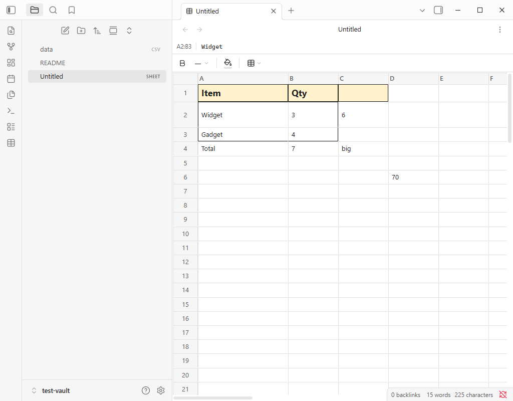
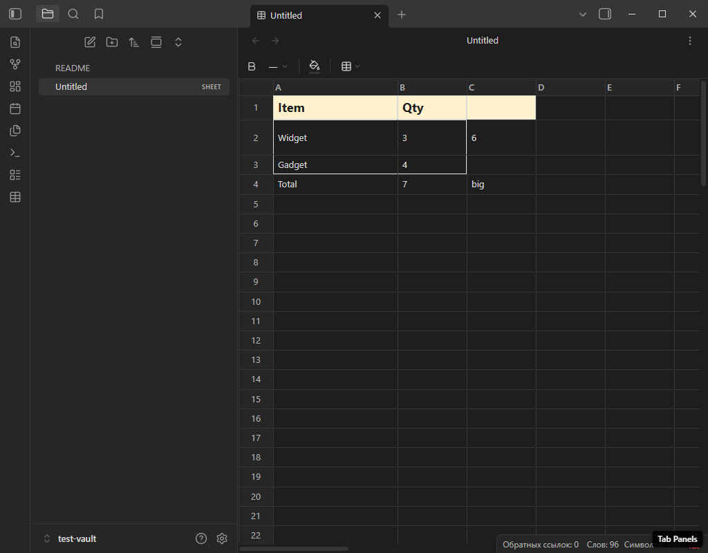
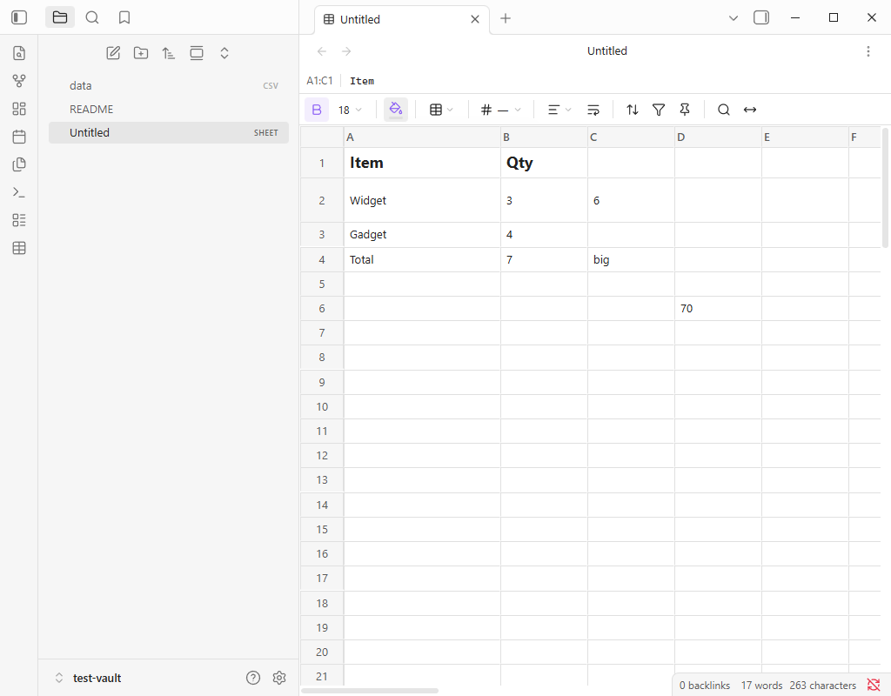

# Spreadsheet Notes

Adds a new kind of note to Obsidian: a **spreadsheet**. Files with the `.sheet`
extension open in a Google Sheets-style grid instead of the Markdown editor —
values, formulas, resizable columns and rows, cell formatting.

Your data stays in your vault as plain-text JSON, so Git, Obsidian LiveSync and
any other sync tool can see and diff it.

The plugin makes **zero network requests**. Nothing is uploaded, no telemetry, no
remote fonts or icons — the grid engine's assets are inlined into the bundle.

Документация на русском: [README.ru.md](README.ru.md)







## Requirements

Obsidian **1.7.2** or newer (the plugin relies on deferred views). Mobile is not
blocked (`isDesktopOnly: false`), but the grid has not been tested on phones.

## Install

**Community plugins** (once the plugin is published): Settings → Community
plugins → Browse → search for *Spreadsheet Notes* → Install → Enable.

**BRAT**: install the [BRAT](https://github.com/TfTHacker/obsidian42-brat)
plugin, then *Add beta plugin* and paste this repository's GitHub URL.

**Manual**: copy `main.js`, `manifest.json` and `styles.css` into
`<your-vault>/.obsidian/plugins/leovale-sheets/`, then enable **Spreadsheet
Notes** in Settings → Community plugins (Restricted Mode must be off).

## Usage

Create a spreadsheet in any of three ways:

- command palette: `Sheets: Create new spreadsheet`
- the table icon in the left ribbon
- right-click a folder in the file explorer → **New spreadsheet**

The file is placed according to your *Default location for new notes* setting and
opens in a new tab straight away.

### Working with the grid

| Action | How |
|---|---|
| Enter a value | Click a cell and start typing, `Enter` to commit |
| Move around | Arrow keys, `Tab`, `Enter` |
| Enter a formula | Start with `=`, e.g. `=SUM(B2:B3)`, `=B2*2`, `=IF(B4>5;"yes";"no")` |
| Resize a column | Drag the right edge of the `A`, `B`, … header |
| Resize a row | Drag the bottom edge of the row number |
| Insert / delete rows and columns | Right-click a header |
| Copy, paste, undo, redo | `Ctrl+C` / `Ctrl+V`, `Ctrl+Z` / `Ctrl+Y` |

Column widths and row heights are stored in the file, so they survive closing and
reopening the note.

Formulas are evaluated by the bundled Jspreadsheet CE engine: `SUM`, `AVERAGE`,
`IF`, `VLOOKUP`, `SUMIF`, `IFERROR`, `SUMPRODUCT`, `TEXTJOIN` and a few hundred
more. **Computed results are never written to the file** — only the formula
source is stored, and everything is recalculated on open.

### Formatting

A single flat toolbar sits above the grid: one 36 px row of borderless 28×28 icon
buttons, with thin separators between groups.

| Button | What it does |
|---|---|
| **B** | Bold. If any cell in the selection is not bold, all of them become bold; otherwise bold is cleared. The button highlights when the selection is bold |
| Font size, `18 ⌄` | Opens a native Obsidian menu: Default, 10, 12, 14, 16, 18, 24. The current size of the selection is shown on the button |
| Fill (bucket) | A 6×2 popup palette: *No fill* plus 11 colours. A strip under the bucket shows the current colour, like in Google Sheets |
| Borders (grid) | Menu: All borders, Outer borders, No borders, then individual sides — top / right / bottom / left |

Formatting applies to the **entire selected range**, not just the active cell.
Text colour inside a filled cell is picked automatically from the fill's
luminance, so a pale yellow background stays readable in the dark theme too.

### Saving

Saving is automatic: roughly 1.5 s after you stop editing, the plugin asks
Obsidian to save (Obsidian adds ~2 s of its own). Closing a tab flushes any
pending changes. `Sheets: Save spreadsheet now` writes the file immediately.

## The `.sheet` file format

Plain JSON, sparse, with a strictly fixed key order:

```json
{
  "format": "leovale-sheet",
  "version": 1,
  "sheets": [
    {
      "name": "Sheet1",
      "rows": 100,
      "cols": 26,
      "colWidths": { "0": 180 },
      "rowHeights": { "1": 51 },
      "merges": {},
      "cells": {
        "A1": { "v": "Item", "s": { "b": true, "fs": 18, "bg": "#fff2cc", "bd": "trbl" } },
        "B2": { "v": 3 },
        "C2": { "f": "=B2*2" }
      }
    }
  ]
}
```

Cell keys, always in this order:

- `v` — value (string, number or boolean)
- `f` — formula source (in which case `v` is omitted)
- `s` — style, also fixed order: `b` (bold), `fs` (font size in px), `bg` (fill,
  `#rrggbb`), `bd` (borders — a subset of `trbl`: top/right/bottom/left, in that
  order)

Serialisation is tuned for sync tools, in particular **Obsidian LiveSync**, which
resolves conflicts on non-Markdown files last-write-wins, without merging:

1. Key order is deterministic — sheets by array position, cells by
   `(row, column)`, subkeys fixed. The same document always serialises to
   byte-identical output.
2. Two-space indent, **one cell per line**. Editing one cell changes exactly one
   line, so LiveSync ships kilobytes instead of the whole file.
3. `LF` line endings only, trailing newline, no BOM.
4. `NaN` and `Infinity` are never written.
5. Empty cells are omitted entirely: a 100×26 sheet with three filled cells is
   about 300 bytes.
6. A `version` field. A file with a version newer than the plugin knows opens
   **read-only**, so the plugin never overwrites data it does not understand.

Raw CSS never reaches the file. The engine keeps styles as inline CSS, but at the
boundary they are explicitly converted to the four normalised properties and back
(`src/cellcss.ts`).

## Data-loss protection

A well-known failure mode of spreadsheet plugins for Obsidian
(`obsidian-spreadsheets`, issues #27 and #29) is `getViewData()` returning an
empty string and Obsidian truncating the file. Three safeguards are in place:

- `getViewData()` goes through the engine only when the document is actually
  dirty; otherwise it returns the last known-good serialisation.
- If serialisation throws, or the result is suspiciously short, the same
  last known-good version is returned instead of an empty string.
- If a file cannot be parsed (broken JSON, foreign format), it opens read-only
  and writing to it is impossible by construction.

## Development

```bash
npm install          # node_modules ~40 MB
npm run build        # tsc --noEmit + esbuild production -> main.js, styles.css
npm run dev          # esbuild --watch
npm test             # 36 unit tests for the format and styles (node --test)
npm run e2e          # e2e in a sandboxed Obsidian, screenshots into tests/shots/
```

Build output: `main.js` ~498 KB, `styles.css` ~91 KB.

Notes on the build configuration:

- Obsidian loads **only** `styles.css`. esbuild writes imported CSS to
  `main.css`, which Obsidian silently ignores, so the `onEnd` step in
  `esbuild.config.mjs` takes `main.css`, runs it through
  `postcss-prefix-selector`, appends the theming layer and writes `styles.css`.
- The engine's CSS is scoped entirely to `.leovale-sheet-root`. `html`, `body`
  and `:root` selectors are *replaced* rather than prefixed, otherwise
  `:root` variables and `body { margin: 0 }` would leak into the whole app.
- The engine's hard-coded colours (`#fff`, `#ccc`, `#f3f3f3`) are remapped to
  Obsidian CSS variables. No `filter: invert(1)` anywhere.

The e2e suite (91 assertions) launches a **separate** Obsidian instance with its
own `--user-data-dir` on CDP port 9333, so your running Obsidian on 9222 is left
alone. It installs and enables the plugin, creates a sheet, types values and
formulas with real keyboard events, drags column and row edges, formats a
selection with real toolbar clicks, waits for autosave, reads the file **from
disk** and checks the format, reopens it, switches themes and captures the
screenshots in `tests/shots/`.

## Limitations

- **Dragging columns and rows is disabled.** Order is stored by index, not by id,
  so reordering would make the saved order a lie.
- Formatting covers fill, font size, bold and borders only. No italics, font
  family, alignment or number formats. Text is left-aligned, numbers included.
- The format supports multiple sheets per file, but there is no UI yet for
  creating a second sheet.
- Merged cells (`merges`) are saved and restored, but there is no toolbar button
  for them — only the engine's own context menu.
- Styles are bound to cell addresses. Inserting a row or column shifts them via
  the engine; exotic scenarios (sorting with styles) are untested.
- When the plugin is disabled, already-open `.sheet` tabs show "no view of
  type…". That is intentional: closing the user's tabs in `onunload` would
  rearrange their workspace.
- Mobile is untested.

## Gotchas worth knowing

**`dirty` is a taken name.** `TextFileView` keeps its own undocumented `dirty`
field on the instance and resets it inside its own save logic. A `private dirty`
field in a subclass collides with it: the flag was being cleared between our
`scheduleSave()` and `getViewData()`, and the file silently stayed in its
just-created state — full grid on screen, empty file on disk. Every view field is
therefore prefixed with `sheet` (`sheetDirty`, `sheetEngine`, `sheetLastGood`, …).
Do not rename them back.

**Clicking the toolbar kills the selection.** Jspreadsheet installs a `mousedown`
handler on `document` that clears the selection on any click outside the grid. The
toolbar therefore captures the selection at `mousedown` time, and the engine also
keeps the last selection from its `onselection` event.

**Row heights are not applied from options.** The `rows: { "1": { height: 51 } }`
option is accepted but has no effect on the first render. Heights are reapplied
with an explicit `setHeight()` after init, with autosave suppressed — otherwise
merely opening a file would mark it modified.

**`setIcon()` with an unknown name silently draws nothing.** The icons
`grid-2x2`, `borders` and `border-all` are **absent** from the Lucide set in this
Obsidian build. `setIcon` neither throws nor logs, it just leaves an empty
element, which is how the Borders button was invisible for a while. Only verified
names are used (`bold`, `table`, `square`, `eraser`, `panel-*`, `paint-bucket`,
`chevron-down`), and the e2e suite asserts that every button and menu item really
rendered an `<svg>`.

**Do not pass a second argument to `getNewFileParent()`.** Calling
`getNewFileParent(path, "Untitled.sheet")` makes Obsidian look for a file creator
for that extension and log an error. The first argument is enough.

## License

MIT — see [LICENSE](LICENSE).

The grid engine is [Jspreadsheet CE](https://github.com/jspreadsheet/ce) 5.0.4
(MIT), with `jsuites` (MIT) and the `@jspreadsheet/formula` "Formula Basic"
engine (MIT per the vendor's banner in the distributed files). Full notices are
in [THIRD-PARTY-NOTICES.md](THIRD-PARTY-NOTICES.md); the vendors' MIT banners are
preserved in the bundle (`legalComments: "eof"`).
