# Spreadsheet Notes: таблицы в Obsidian

Плагин добавляет в Obsidian новый тип заметки: электронную таблицу. Файлы с
расширением `.sheet` открываются не в редакторе Markdown, а в сетке в духе
Google Sheets: значения, формулы, ширины колонок, форматирование ячеек.

Данные лежат в вашем хранилище (vault) обычным текстовым JSON. Его видит Git,
Obsidian LiveSync и любой другой инструмент синхронизации. Сетевых запросов
плагин не делает совсем: ни телеметрии, ни внешних шрифтов и иконок.

## Чем это отличается от Sheet Plus

Sheet Plus это устоявшийся плагин-таблица для Obsidian, и умеет он гораздо больше:
диаграммы, сводные таблицы, картинки в ячейках. Если нужно это, берите его. Ниже
причины, по которым этот плагин вообще появился.

- **Данные не теряются.** Файл с `version` новее той, что понимает плагин,
  открывается только для чтения; сериализация обёрнута предохранителем и при
  сбое возвращает последние заведомо корректные байты, а не пустую строку;
  переводы строк только `LF`. У лидера категории есть открытые issue о порче
  данных, в том числе из-за обработки `CRLF`.
- **Обычный JSON с одной ячейкой на строку.** Правка одной ячейки меняет одну
  строку файла; именно это нужно Git и Obsidian LiveSync, чтобы передавать
  килобайты вместо всего документа. Sheet Plus хранит данные однострочным
  JSON-блобом, поэтому любая правка переписывает файл целиком одной строкой
  диффа.
- **1,2 МБ против 18,5 МБ.** Sheet Plus не проходит лимит Obsidian Sync в 5 МБ
  на файл, то есть сам плагин через Obsidian Sync не синхронизируется. (Из этих
  1,2 МБ примерно 0,7 МБ — чтение и запись `.xlsx`, которые грузятся лениво и не
  выполняются вовсе, пока вы что-нибудь не импортируете или не экспортируете.)
- **Читается целиком за вечер.** MIT, две публичные зависимости
  (Jspreadsheet CE и SheetJS), весь путь сохранения лежит в этом репозитории. У
  Sheet Plus путь сохранения лежит в неопубликованных приватных модулях, плюс
  лицензионный сервер.
- **CSS не течёт, глобальные объекты не патчатся.** Каждый селектор
  префиксован `.leovale-sheet-root`, в `window` и в прототипы Obsidian ничего не
  добавляется.
- **На мобильном можно редактировать.** Sheet Plus там только для чтения. Здесь
  на планшете работают ввод, формулы и форматирование.

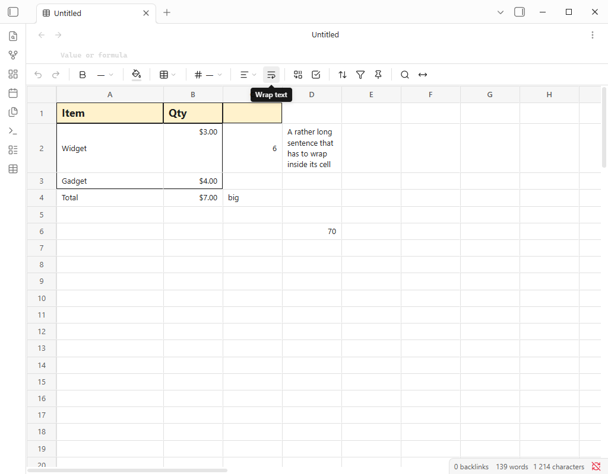

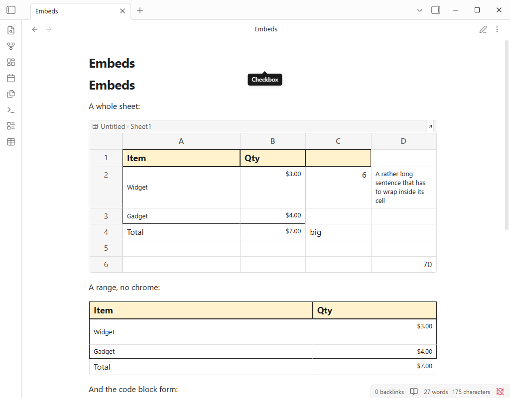

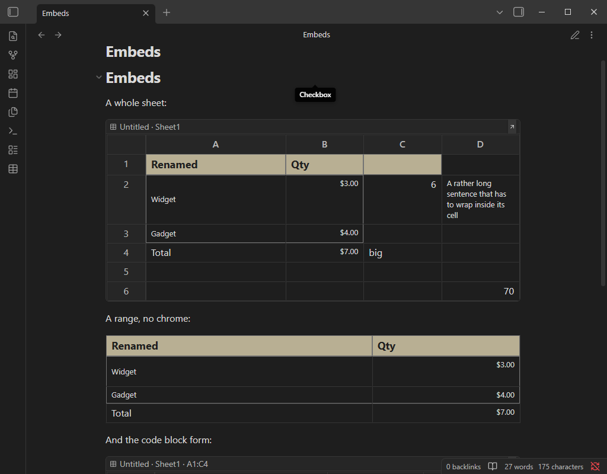

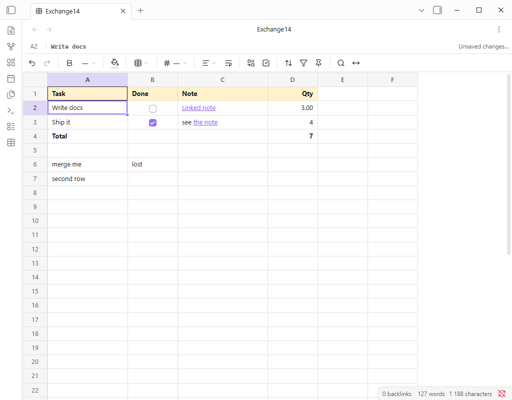

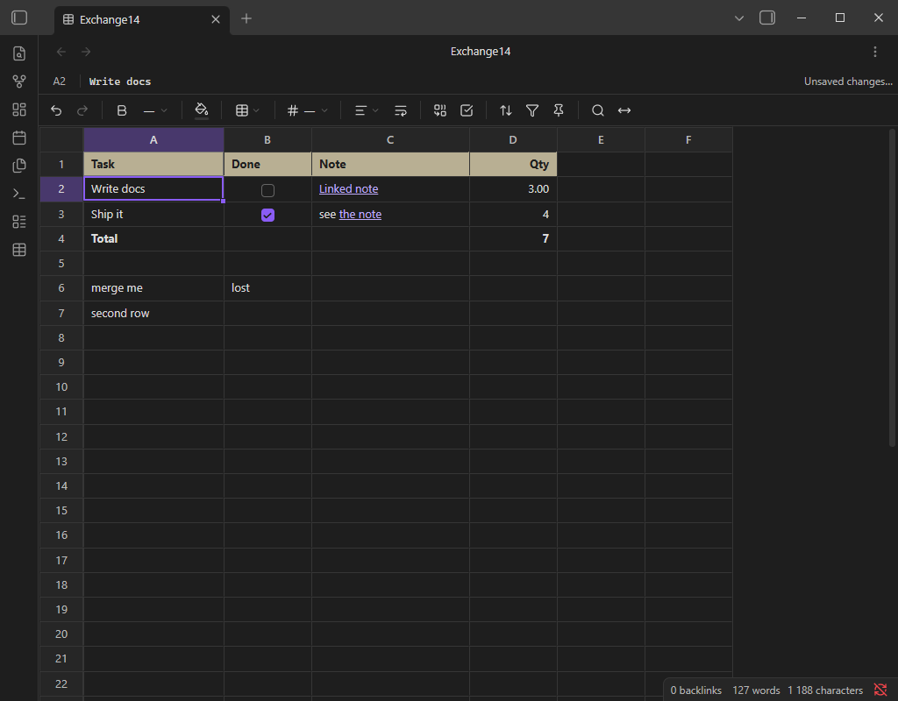

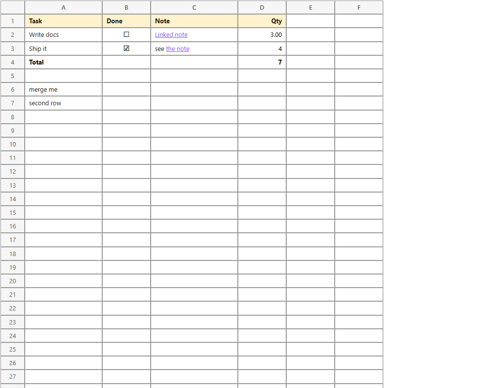

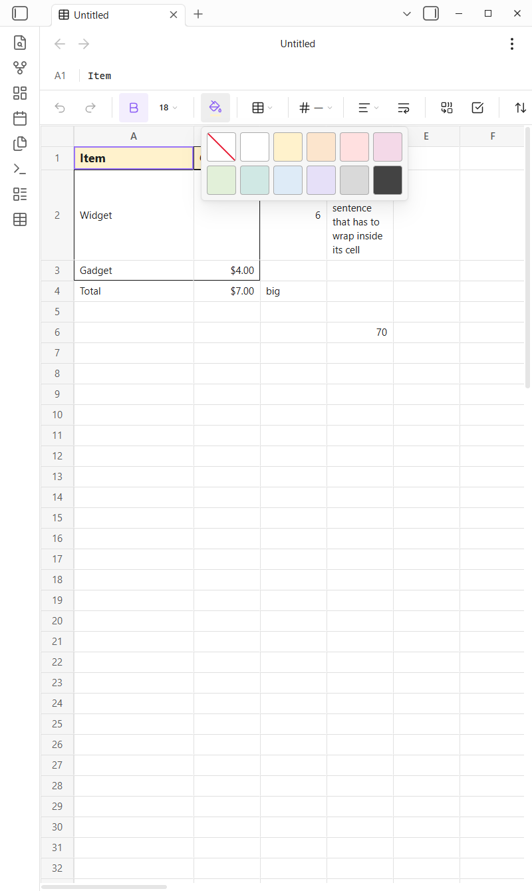

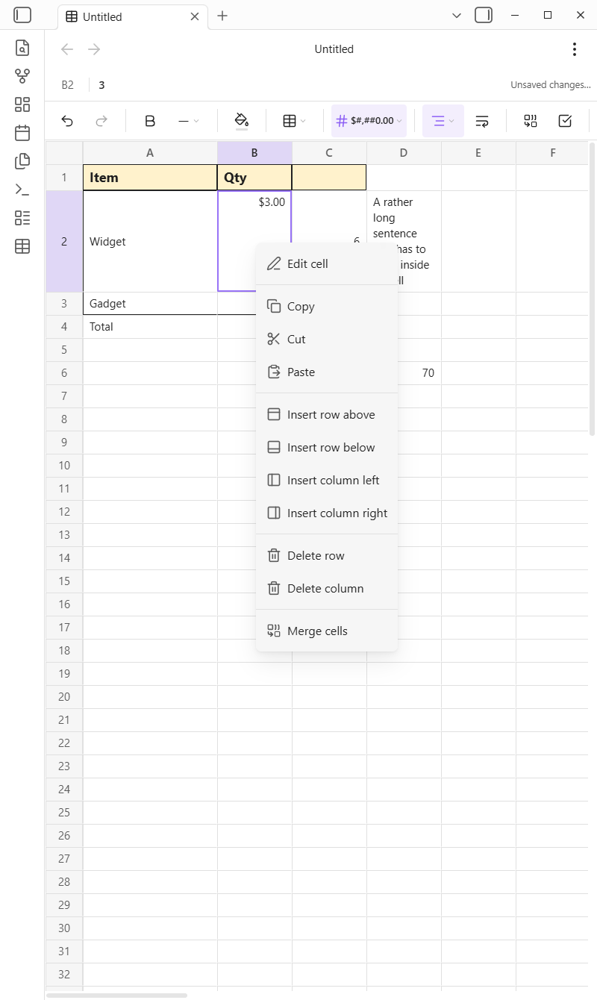

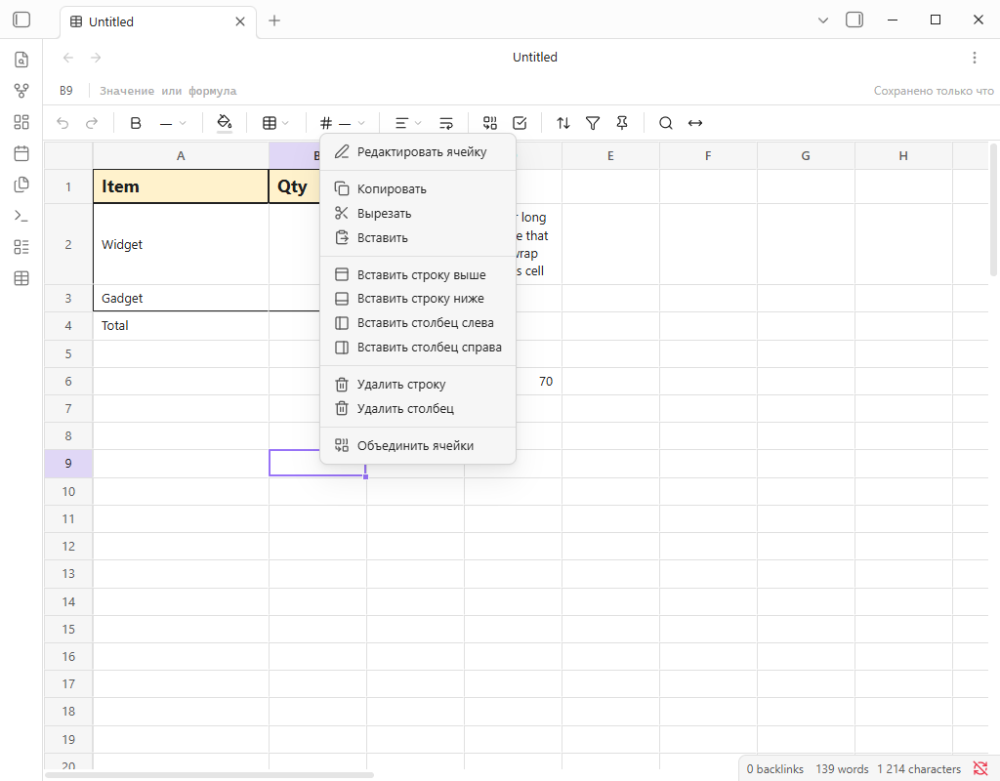

---

## Установка

Через [BRAT](https://github.com/TfTHacker/obsidian42-brat): поставить BRAT из
каталога сообщества, выполнить команду `BRAT: Add a beta plugin for testing`,
вставить `https://github.com/ruslanakhmetov1986-collab/obsidian-sheet-notes`.
BRAT скачает свежий релиз и дальше будет обновлять плагин сам.

Вручную: взять `main.js`, `manifest.json`, `styles.css` из
[последнего релиза](https://github.com/ruslanakhmetov1986-collab/obsidian-sheet-notes/releases)
и скопировать в `<ваш-vault>/.obsidian/plugins/leovale-sheets/`, затем в
настройках выключить «Ограниченный режим» и включить Spreadsheet Notes.

Требуется Obsidian 1.7.2 или новее (плагин опирается на deferred views).

Мобильная версия работает: базовый цикл (открыть, ввести, отформатировать,
сохранить, переоткрыть) проверен руками на Android-планшете, включая формулы и
палитру заливки. Номера строк при горизонтальном скролле остаются на месте,
кнопки панели и образцы палитры на тач-устройствах 44 px, нижняя строка не
прячется за навигационной панелью Android, а длинные формулы правятся в строке
формул. Скролл пальцем больше не уводит выделение, лист остаётся там, куда его
пролистали, контекстное меню переведено и с рядами по 44 px, а боковая панель
Obsidian по-прежнему открывается свайпом от левого края экрана — подробности в
разделе «Тач: что делает палец». На телефонах не проверялось.

Язык интерфейса следует языку Obsidian (Настройки → Об программе → Язык), и
переводов двенадцать: английский, русский, китайский упрощённый, китайский
традиционный, немецкий, французский, испанский, японский, корейский,
португальский (Бразилия), итальянский и польский. Код с регионом сводится к
языку (`de-AT` → немецкий), традиционный китайский — отдельная таблица (`zh-TW`,
`zh-Hant`, `zh-HK`), европейский португальский использует бразильскую таблицу,
всё остальное — английский. Названия команд остаются английскими: так принято в
Obsidian.

## Как пользоваться

**Создать таблицу** — тремя способами:

- палитра команд: `Sheets: Create new spreadsheet`;
- иконка таблицы на левой ленте (ribbon);
- правый клик по папке в проводнике файлов → «New spreadsheet».

Файл создаётся рядом по правилам вашей настройки «Папка для новых заметок» и
сразу открывается в новой вкладке.

**Какие расширения открываются в сетке**

| Расширение | Примечание |
|---|---|
| `.sheet` | Основное. Регистрируется, если его не занял другой плагин |
| `.lsheet` | Регистрируется всегда. Тот же формат, используется когда `.sheet` занят |
| `.csv` | Открывается в той же сетке и пишется обратно как CSV, см. ниже |

`.sheet` claim-ят сразу три плагина: Sheet Plus, Excel и Spreadsheets, а Obsidian
отдаёт расширение ровно одному view. Если кто-то из них успел первым, плагин
показывает уведомление с именем владельца, `.sheet` не трогает, а новые таблицы
создаёт с расширением `.lsheet`. Всё остальное работает как обычно. Уже
существующие файлы продолжают открываться в том плагине, которому принадлежит их
расширение; переименование в `.lsheet` переносит файл сюда.

**Файлы CSV**

`.csv` открывается в той же сетке и сохраняется обычным CSV.

- Разделитель определяется по самому файлу (`,` или `;`) и сохраняется при
  записи. Текущий показан плашкой справа в строке формул.
- Кавычки по RFC 4180: `"` внутри закавыченного поля удваивается; при записи поле
  закавычивается только если содержит разделитель, кавычку или перевод строки.
- Переводы строк только `LF`, никогда `CRLF`, в конце файла перевод строки.
- Форматирование (жирный, заливка, кегль, границы) применяется на экране, но **не
  сохраняется**: в CSV его некуда положить. Ширины колонок, высоты строк,
  объединения, закрепление и фильтры — тоже. Исключение — сортировка: она двигает
  сами значения, поэтому отсортированный CSV остаётся отсортированным и на диске.
- Формулу вводить можно, она считается живьём, но в файл попадает **текст**
  формулы (`=SUM(A1:A2)`) — больше ячейка CSV не вмещает. Excel в этом файле
  увидит настоящую формулу, pandas — строку.
- Очистка всех ячеек CSV не приводит к записи пустого файла: это тот же
  предохранитель от обрезания. Нужно удалить файл — удалите файл.

Детерминированная JSON-сериализация, описанная ниже, относится только к
`.sheet` и `.lsheet`.

**Строка формул**

Над панелью инструментов — одна строка: адрес активной ячейки и её сырое
содержимое. Ячейка с `=SUM(B2:B3)` показывает там формулу, а в сетке видно `7`.
Ввод подтверждается `Enter`, `Escape` возвращает прежнее значение. На планшете это
основной способ править формулы: встроенный редактор ячейки шириной ровно в
ячейку.

`Enter` заодно **переводит выделение на ячейку ниже** — ровно как `Enter`,
набранный в самой ячейке, — так что столбик значений вводится из строки формул
подряд, не трогая сетку между значениями. Кому достаётся фокус после этого,
зависит от устройства, и это осознанно:

- **Десктоп**: фокус возвращается в сетку, и стрелки снова работают сразу. Там
  строка формул — удобство, а печатают в сетке.
- **Тач**: поле сохраняет фокус, экранная клавиатура остаётся поднятой. На
  планшете эта строка и есть редактор, и прятать клавиатуру после каждого
  значения означало бы «тап по следующей ячейке, тап по строке, ввод» на каждое
  число. Убирает клавиатуру `Escape` или тап по сетке.

**Работа с сеткой**

| Действие | Как |
|---|---|
| Ввести значение | Кликнуть по ячейке и начать печатать, `Enter` — подтвердить |
| Перемещение | Стрелки, `Tab`, `Enter` |
| Формула | Начать с `=`, например `=SUM(B2:B3)`, `=B2*2`, `=IF(B4>5;"да";"нет")` |
| Изменить ширину колонки | Потянуть за правую границу заголовка `A`, `B`, … |
| Изменить высоту строки | Потянуть за нижнюю границу номера строки |
| Вставить/удалить строку, колонку | Правый клик в любом месте сетки (на тач-устройстве — долгое нажатие) |
| Контекстное меню | Правый клик или долгое нажатие на планшете: правка, копирование, вырезание, вставка, вставка и удаление строк и колонок, объединение |
| Копировать/вырезать/вставить | `Ctrl+C` / `Ctrl+X` / `Ctrl+V` |
| Отменить, повторить | `Ctrl+Z`, `Ctrl+Y` или `Ctrl+Shift+Z`, либо две кнопки на панели. Покрывает сортировку, объединение, вставку, заполнение вниз, правку строк и колонок — см. «Отмена и повтор» |
| Редактировать активную ячейку | `F2` |
| Заполнить вниз | `Ctrl+D` (верхняя строка выделения на остальные; для одной ячейки — ячейка сверху) |
| Продолжить ряд | Потянуть за квадратик в правом нижнем углу выделения (маркер заполнения) |
| Начало / конец строки | `Home` / `End` (`End` встаёт на последнюю заполненную ячейку, а не на колонку Z) |
| A1 / последняя занятая ячейка | `Ctrl+Home` / `Ctrl+End` |
| Прыжок к краю данных | `Ctrl+←↑→↓` |
| Очистить выделение | `Delete` |
| Поиск по таблице | `Ctrl+F` |
| Сохранить сейчас | `Ctrl+S` |
| Точная ширина колонки | Кнопка `↔` на панели или команда `Sheets: Set column width` |
| Ширина по содержимому | Двойной клик по правой границе заголовка колонки |
| Объединить или разбить ячейки | Кнопка объединения на панели или команда `Sheets: Merge or split cells` |
| Превратить ячейки в галочки | Кнопка-галочка на панели |
| Открыть `[[ссылку]]` в ячейке | Клик по ней (`Ctrl`+клик — в новой вкладке) |
| Прошлые версии этого файла | `Sheets: Version history` либо правый клик по файлу в проводнике |
| Печать | `Sheets: Print spreadsheet` |
| Excel | `Sheets: Export as .xlsx` / `Sheets: Import .xlsx as sheet` |

С зажатым `Shift` любая клавиша перемещения расширяет выделение, а не двигает
его. Все эти клавиши живут только пока фокус в самой сетке: набор в строке
формул, в поле поиска или внутри редактора ячейки остаётся полем ввода, а во
всём остальном Obsidian они по-прежнему принадлежат Obsidian.

**Копирование, вырезание и вставка сохраняют оформление.** Внутри плагина
скопированный диапазон переносит вместе со значениями заливки, жирность,
рамки, выравнивание, числовые маски и ячейки-галочки — в любую другую
таблицу и в таблицу в отдельном окне. Обычный текст с табуляциями при этом
по-прежнему кладётся в системный буфер, так что диапазон вставляется в Excel,
в Google Sheets или в заметку как раньше, а скопированное в другом приложении
вставляется в сетку простыми значениями, как и прежде. `Ctrl+X` — это
ПЕРЕМЕЩЕНИЕ: вырезанные ячейки помечаются пунктиром и очищаются той вставкой,
которая перемещение завершает, поэтому передумать ничего не стоит — `Esc`
отменяет вырезание. Формулы вставляются как написаны (`=B2+1` остаётся
`=B2+1`, под новый адрес не переписывается) — то же правило, что у заполнения
вниз.

**Маркер заполнения продолжает ряд.** Выделите `1, 2, 3`, потяните за
квадратик в правом нижнем углу выделения — и ячейки, через которые вы протянули,
станут `4, 5, 6`. Что он распознаёт, в этом порядке:

| Выделено | При протягивании |
|---|---|
| одна ячейка | копируется как есть — по одной ячейке шаг не угадать |
| `1, 2, 3` / `10, 8` / `0.5, 1.0` | арифметическая прогрессия продолжается в любую сторону |
| `2026-01-01, 2026-01-02` | следующие дни; `2026-01-15, 2026-02-15` — шаг в целый МЕСЯЦ с сохранением числа |
| `Товар 1, Товар 2` | `Товар 3` — текст остаётся, меняется только число на конце, ведущие нули сохраняются |
| формула | относительные ссылки сдвигаются, `$A$1` — нет |
| всё остальное | образцы повторяются по кругу |

Работает вниз, вверх, влево и вправо; пока тянете, пунктирная рамка показывает,
куда ляжет ряд. Заливки, жирность, рамки, числовые маски и галочки выделенных
ячеек повторяются на заполненных, а всё протягивание отменяется одним `Ctrl+Z`.
На планшете маркер отзывается на область 24 px, а не на видимый квадратик в 7 px.

Формулы считает встроенный движок Jspreadsheet CE: есть `SUM`, `AVERAGE`, `IF`,
`VLOOKUP`, `SUMIF`, `IFERROR`, `SUMPRODUCT`, `TEXTJOIN` и ещё несколько сотен
функций. **Результаты формул не сохраняются в файл** — только исходный текст
формулы; при открытии всё пересчитывается заново.

**Числа выравниваются по правому краю** и рисуются моноширинными цифрами, чтобы
разряды в колонке совпадали по вертикали при любом шрифте интерфейса. Текст, в
котором просто есть число (`Товар 1`, `12 штук`), остаётся слева, а
выравнивание, заданное вручную, всегда важнее.

**Тач: что делает палец**

У планшета нет правой кнопки, наведения и клавиатуры, а движок сетки понимал
касание как «выделить то, на что попал палец, немедленно». Это неверно ровно с
того момента, как палец собирался пролистать. Правила теперь такие:

| Жест | Что происходит |
|---|---|
| Тап | Выделяет ячейку. Решение принимается, когда палец **отрывается** |
| Протяжка | Скроллит лист. Выделение и строка формул не меняются |
| Долгое нажатие (0,5 с) | Открывает контекстное меню на этой ячейке |
| Свайп от левого края | Открывает боковую панель Obsidian, при условиях ниже |

**Скролл не забирает выделение.** Пока палец на экране, не выделяется ничего.
На отрыве касание считается тапом, только если оно уложилось в 10 px и в 300 мс;
всё, что дольше или дальше, было скроллом, а скролл не меняет ничего. Ячейка, с
которой вы работали, и формула, которую она показывала в строке формул,
переживают протяжку через весь лист.

**Скролл остаётся там, куда его довели.** 0,7 с после жеста плагин не скроллит
сетку сам. Без этого правила пан до колонки M заканчивался возвратом к колонке A:
мгновением позже кто-то просил «показать выделенную ячейку».

**Левый край остаётся боковой панели.** Obsidian на мобильном читает
горизонтальный пан как «открой панель» и слушает его над сеткой — поэтому сетка
не пускает этот жест наружу, иначе горизонтальный скролл таблицы открывал бы
проводник файлов. С 1.4.x правило уже: касание, начатое в **24 px от левого края
экрана** при листе, **прокрученном до упора влево**, принадлежит Obsidian, и
панель открывается как везде. В любом другом месте сетки, или когда лист
пролистан вправо (где свайп влево явно означает «верни его назад»), жест
принадлежит сетке. Кнопка в шапке открывает панель по-прежнему.

**Контекстное меню — своё**, не движка: переведено на все двенадцать языков,
ряды по 44 px на тач-устройстве, и никаких подсказок `Ctrl+C` на устройстве без
`Ctrl`. В нём: правка ячейки, копировать, вставить, вставить строку выше или
ниже, вставить колонку слева или справа, удалить выделенные строки или колонки,
объединить или разъединить. На десктопе это то же меню на правой кнопке мыши.

Долгого нажатия «открыть редактор» намеренно больше нет (оно срабатывало
посреди скролла). Нажатие открывает меню, а первый пункт меню — «Редактировать
ячейку».

**Форматирование** — плоская панель над таблицей, в духе панели Google Sheets:
один ряд высотой 36 px, кнопки-иконки 28×28 без рамок и теней, тонкие
разделители между группами.

| Кнопка | Что делает |
|---|---|
| **B** (иконка «bold») | Жирный шрифт. Если в выделении есть хоть одна нежирная ячейка — жирными станут все; иначе жирность снимается со всех. Нажатая кнопка подсвечивается акцентным цветом |
| Размер, `18 ⌄` | Открывает обычное меню Obsidian: «По умолчанию», 10, 12, 14, 16, 18, 24. Текущий размер выделения показан прямо на кнопке |
| Заливка (ведро) | Всплывающая палитра 6×2: «Без заливки» (перечёркнутый квадрат) и 11 цветов. Под ведром — полоска текущего цвета, как в Google Sheets |
| Границы (сетка) | Меню: «Все границы», «Внешние границы», «Без границ», затем отдельные стороны — сверху / справа / снизу / слева |
| Формат числа, `# ⌄` | Меню: «Авто», `0.00`, `#,##0`, `#,##0.00`, `0%`, валюта в $, € или ₽, `yyyy-mm-dd`, дата и время. Текущая маска показана на кнопке |
| Выравнивание | Одно меню на две оси: по левому краю / по центру / по правому, затем по верхнему краю / по середине / по нижнему |
| Перенос текста | Переключатель. Длинный текст переносится внутри ячейки, строка становится выше |
| Объединение (`⧉`) | Объединяет выделение в его левую верхнюю ячейку или, если выделение уже объединено, разбивает его обратно. Кнопка подсвечена, пока курсор внутри объединения |
| Галочка (`☑`) | Превращает выделенные ячейки в галочки и обратно |
| Сортировка (`⇅`) | Меню: А → Я, Я → А, «Сбросить сортировку». Работает по колонке, с которой начинается выделение |
| Фильтр (воронка) | Все значения этой колонки галочками, плюс «Показать все» и «Сбросить все фильтры» |
| Закрепление (кнопка) | Закрепить строки над выделением, колонки слева от него или и то и другое; «Снять закрепление» отменяет |
| Поиск (лупа) | Полоса поиска, то же самое что `Ctrl+F` |
| Ширина колонки (`↔`) | Точная ширина в пикселях для всех колонок выделения или «По содержимому» |

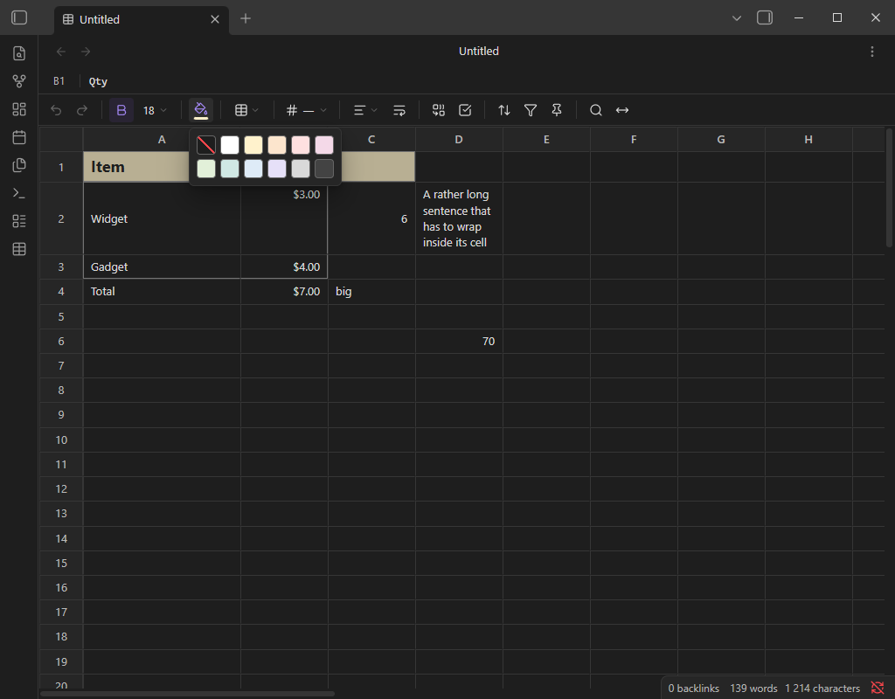

Формат применяется ко **всему выделенному диапазону**, а не только к активной
ячейке. Цвет текста внутри залитой ячейки подбирается автоматически по яркости
заливки — поэтому светло-жёлтый фон читается и в тёмной теме тоже.

### Сортировка, фильтры и закреплённые области

Всё трое сохраняются в файл, так что таблица открывается ровно такой, какой её
оставили.

**Сортировка двигает строки целиком.** Заливка, границы, формат числа и всё
остальное, что несёт строка, едет вместе с ней — потому что в этом формате
строка их и несёт: сортировка переписывает документ и пересобирает сетку, а не
переставляет строки внутри движка. Колонка, по которой отсортировано, помечена
стрелкой в заголовке.

- **Закреплённые строки не сортируются.** Это шапка, ровно как в Google Sheets.
  Если ничего не закреплено — участвуют все строки.
- Лист с **объединёнными ячейками отсортировать нельзя**, о чём плагин и
  говорит: объединение живёт на адресах, и перестановка строк под ним его
  разорвёт.
- **Ссылки в формулах не пересчитываются.** Формула переезжает как написана:
  `=B2*2`, уехавшая на три строки вниз, по-прежнему говорит `B2`. Если такое
  реально случилось, показывается уведомление.
- «Сбросить сортировку» не возвращает прежний порядок: новый порядок — это и есть
  порядок файла, возвращаться некуда. Пункт снимает только пометку.

**Фильтры прячут строки, но ничего в них не меняют.** В меню — значения, которые
в колонке реально есть; снятая галочка прячет её строки, а в файл попадает
список ещё разрешённых значений. Пустые ячейки не прячутся никогда: пустоты в
меню нет, и вернуть такие строки было бы нечем, кроме сброса фильтра. У
отфильтрованной колонки в заголовке точка.

**Закреплённые строки и колонки** остаются на месте, пока остальная сетка
прокручивается. Поставьте курсор туда, где закреплённая часть должна кончаться
(`B3` — две строки и одна колонка), и выберите, что закрепить.

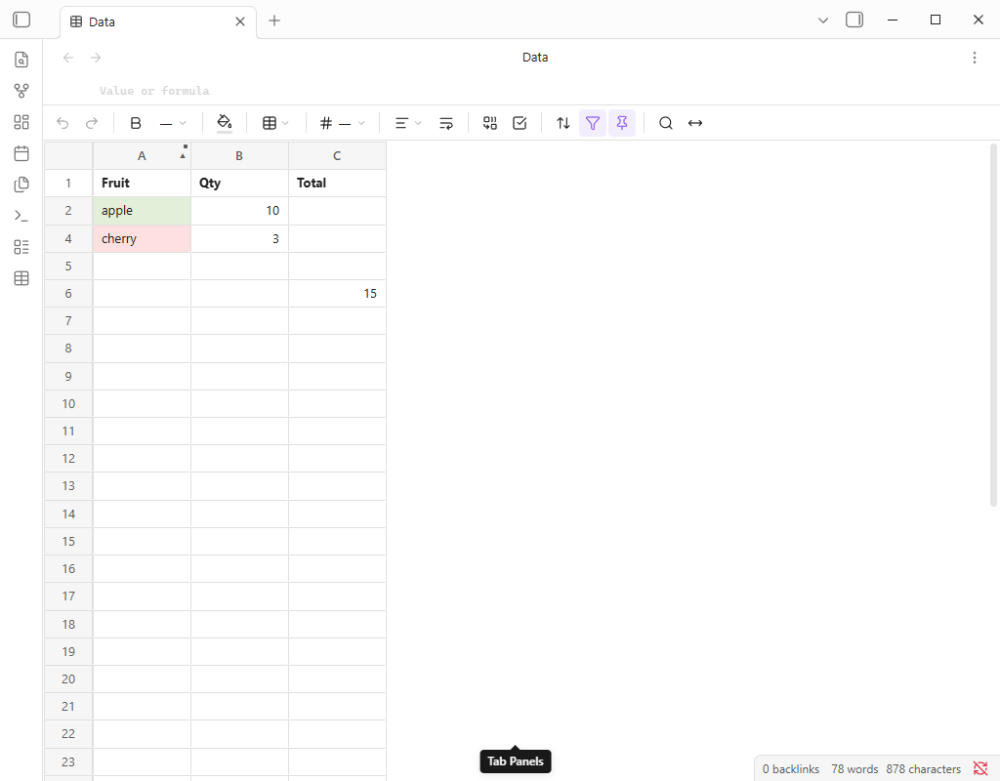

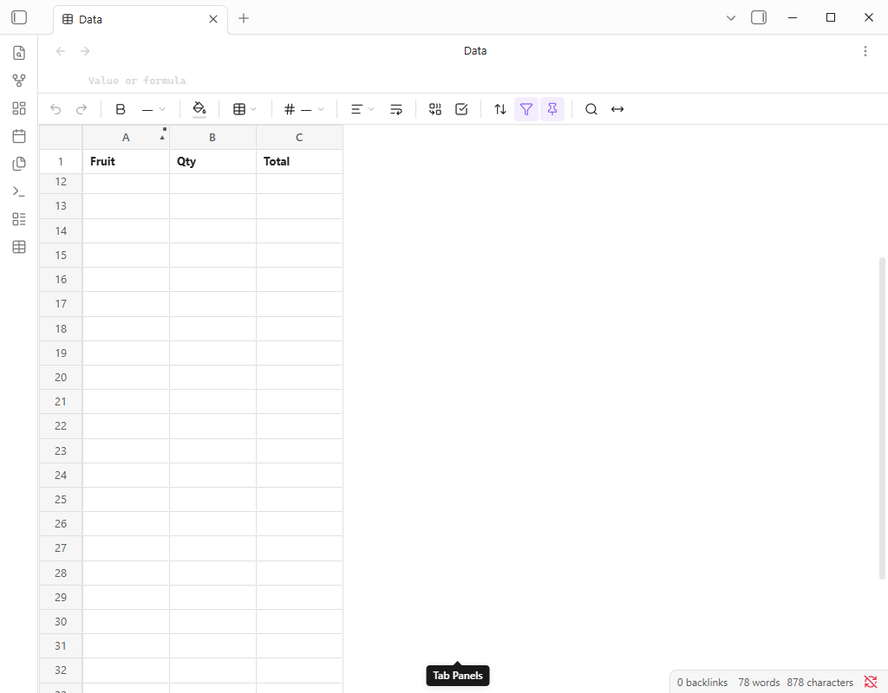

### Объединённые ячейки

Выделите диапазон и нажмите кнопку объединения: ячейки становятся одной, а
остаётся значение левой верхней. Всё остальное, что лежало в диапазоне,
опустеет, поэтому сначала спрашивают — с числом ячеек, которые вот-вот потеряют
содержимое. Если терять нечего, ничего и не спрашивают.

Та же кнопка объединение и разбивает — она подсвечена, пока курсор внутри
объединения, — и разбивка не спрашивает ничего, потому что при ней потерять
нечего. Вернувшиеся ячейки пустые; значение, пережившее объединение, остаётся
там же, где было.

Объединения живут в файле (`"merges": { "A6": [2, 1] }` — сначала колонки, потом
строки) и восстанавливаются при открытии. **Лист с объединёнными ячейками
отсортировать нельзя**: объединение живёт на адресах, и перестановка строк под
ним его разорвёт. Так было и до появления кнопки, кнопка этого не меняет — о чём
уведомление после объединения и говорит.

### Ячейки-галочки

Кнопка-галочка превращает выделенные ячейки в галочки. Галочка — это **тип**
ячейки, а не формат: в файле появляется ключ `"t": "cb"`, а значение под ним
становится настоящим булевым.

```json
"B2": { "v": true, "t": "cb" }
```

- Клик по галочке пишет `true` или `false` и сохраняется как любая другая
  правка.
- Значения при переключении типа не трогаются: колонка из `true`/`false`
  становится колонкой отмеченных и снятых галочек, а повторное нажатие кнопки
  возвращает слова.
- Ячейка, которую ни разу не отметили, всё равно попадает в файл (как `false`),
  иначе галочка исчезла бы при следующем сохранении.
- Галочка всегда рисуется по центру ячейки, поэтому горизонтальное выравнивание,
  заданное на ней, не видно.
- Сама «птичка» внутри — обсидиановская, ровно та же, что в списке задач, и
  поэтому слушается цветов галочек из вашей темы. Плагин рисует только рамку
  вокруг неё: обычную бы закрасила таблица стилей движка сетки.
- Заливка, границы и всё прочее по-прежнему применяются, а в `.xlsx` колонка
  галочек уезжает как родные для Excel TRUE/FALSE.

**Выпадающие списки в ячейках вырезаны намеренно.** Типы ячеек в движке сетки —
свойство **колонки** (`columns[].type`), а не ячейки: выпадающий список забрал бы
себе целую колонку, списку его вариантов у колонки места нет, а список в одной
ячейке дрался бы с движком при каждой вставке строки. Галочка от этого свободна,
потому что не требует от движка вообще никакой настройки на ячейку — её рисует
сам плагин поверх отрисовки движка, ровно так же, как рисуется маска числа.
Выпадающему списку нужна помощь движка, а движок предлагает её только на колонку
целиком.

### Ссылки на заметки в ячейках

Ячейка, в тексте которой есть `[[Заметка]]`, показывает настоящую ссылку, и клик
по ней открывает заметку (`Ctrl`+клик — в новой вкладке). При наведении
запрашивается обычное превью страницы Obsidian, так что всплывашка настоящая, с
вашими же настройками задержки и модификатора.

- **В файле текст лежит ровно так, как его набрали.** `[[Заметка]]` — обычная
  строка, про ссылки формат не знает ничего, и старая сборка плагина покажет ту
  же ячейку простым текстом.
- Псевдонимы и заголовки работают: `[[Заметка|видимый текст]]`,
  `[[Заметка#Заголовок]]`, `[[Заметка#^блок]]`. Без псевдонима
  `Заметка#Заголовок` читается как `Заметка > Заголовок`.
- Пока ячейку **правят**, видно сырой текст, вместе со скобками: правят именно
  его. Ссылка возвращается после подтверждения.
- `![[вставки]]` ссылками не считаются: заметка, отрисованная внутри ячейки
  таблицы, — не то, что бывает, поэтому `!` оставляет текст текстом.
- Во встроенной в заметку таблице ссылки тоже работают: клик открывает заметку
  так же, как открыла бы ссылка в самой заметке.
- `Sheets: Copy selection as Markdown table` копирует **исходник** ссылки, а не
  её подпись, — чтобы ссылка продолжала работать в той заметке, куда вы её
  вставите.

### Печать

`Sheets: Print spreadsheet` открывает системный диалог печати, а на странице —
только таблица: ни панели инструментов, ни строки формул, ни левой ленты, ни
полосы вкладок, ни строки состояния. Сетка перестаёт быть окном с прокруткой и
раскладывается целиком, поэтому печатается не та часть, что была на экране, а все
строки листа, и буквы колонок повторяются вверху каждой страницы.

Заливка, границы и форматы чисел печатаются как есть; выделение и закреплённые
области — нет (закрепление это идея про прокрутку, а `position: sticky` на бумаге
паркует приколотую строку на первой странице и оставляет дыру на всех
остальных). Галочка печатается символом `☐` или `☑`, а не нарисованным
элементом управления: так она переживает принтер с выключенной «печатью фона» и
попадает в текстовый слой PDF.

Всё остальное в окне не трогается: правила печати действуют, только пока
активная вкладка — таблица, поэтому печать заметки остаётся делом самого
Obsidian, ровно как раньше.

### Файлы Excel

Две команды переносят документ целиком между этим плагином и Excel,
LibreOffice, Google Sheets или чем угодно ещё, что понимает `.xlsx`.

**`Sheets: Export as .xlsx`** (она же в контекстном меню файла `.sheet` или
`.lsheet`) открывает **диалог сохранения**: имя и папка таблицы уже подставлены,
а выбрать можно любое место на диске — «Загрузки», флешку, общую папку. Книгу
делают, чтобы кому-то отправить, а хранилище — не папка «Загрузки». Отмена не
пишет ничего и ничего не говорит. Если выбранный путь **внутри** хранилища, файл
пишется через Obsidian и сразу появляется в проводнике; снаружи — просто
пишется на диск.

На телефоне и планшете диалога файлов нет, поэтому экспорт кладётся рядом с
таблицей как `имя.xlsx`, о чём и сообщает уведомление.

Уезжают значения, формулы, жирность, кегль, заливка, границы, форматы чисел,
выравнивание, перенос текста, ширины колонок, высоты строк, объединения и по
одному листу на страницу. Файл, который вы соглашаетесь перезаписать,
заменяется целиком. Экспорт открытого во вкладке файла экспортирует то, что **во
вкладке**, включая последнюю секунду набора, которая ещё не сохранена.

**`Sheets: Import .xlsx as sheet`** спрашивает файл где угодно на диске; для
`.xlsx`, который уже лежит в хранилище, то же самое делает пункт его контекстного
меню. Возвращается всё, что пишет экспорт, плюс то, что положил туда Excel:
книга из нескольких листов становится документом из нескольких страниц. Новый
файл никогда ничего не перезаписывает — `Budget.sheet`, потом `Budget 1.sheet` —
и открывается в новой вкладке.

Что поездку не переживает:

- **Ячейки-галочки** становятся экселевскими TRUE/FALSE: типа «галочка» в
  `.xlsx` нет. Обратный импорт даёт булевы значения, и кнопка-галочка возвращает
  их в галочки одним нажатием.
- **Разделители в формулах** переводятся: `=IF(A1>5;"да";"нет")` пишется как
  `IF(A1>5,"да","нет")` — другой формы `.xlsx` не знает. Точки с запятой внутри
  закавыченной строки не трогаются.
- **Результаты формул** не пишутся; Excel пересчитывает их при открытии, и это
  то же самое правило, которому следует этот формат.
- **Сортировка, фильтры и закрепление** остаются в файле `.sheet`. Это то, как на
  лист смотрят, а Excel моделирует все три достаточно иначе, чтобы точный перевод
  был гаданием.
- **Всё, что есть в Excel и чего нет здесь**: диаграммы, картинки, сводные
  таблицы, условное форматирование, именованные диапазоны, несколько шрифтов,
  цвет текста по символам. При импорте это отбрасывается, а не дорисовывается
  наполовину.
- **Имена листов** обрезаются до 31 символа и теряют `[ ] : * ? / \`: Excel
  отказывается открывать файл, имена листов которого не следуют его собственным
  правилам.

### Поиск по таблице

`Ctrl+F` в сетке (или лупа на панели) открывает полосу поиска над таблицей.
Совпадения подсвечиваются по мере набора, `Enter` и `Shift+Enter` ходят по ним,
счётчик показывает, где вы сейчас, `Escape` закрывает полосу и снимает
подсветку. Ищется то, что таблица показывает, включая результаты формул; ничего
при этом не меняется.

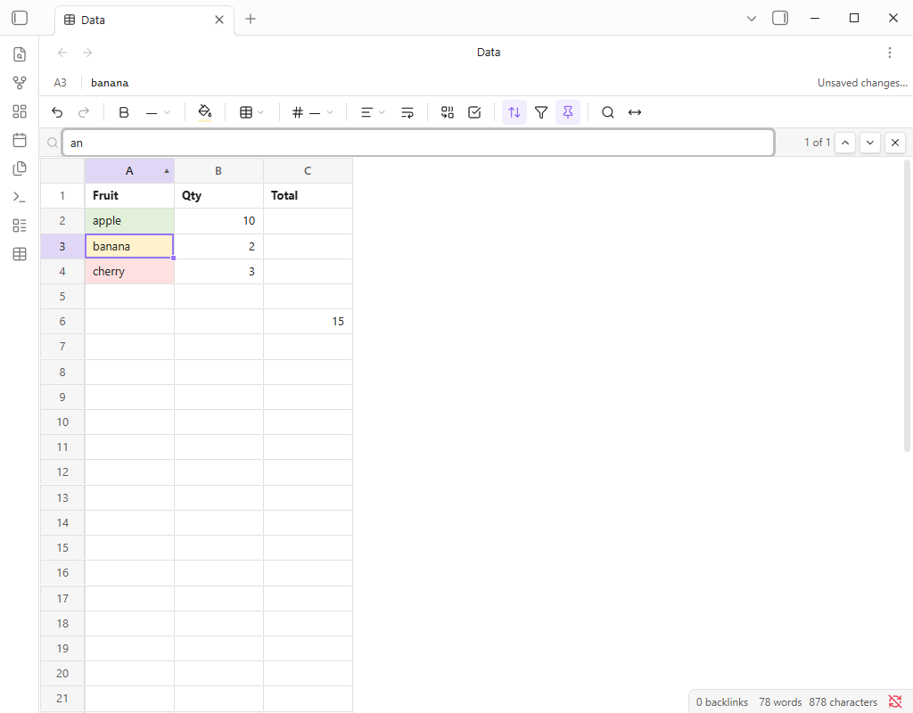

### Markdown-таблицы туда и обратно

Две команды переносят прямоугольник ячеек между сеткой и любой заметкой:

- `Sheets: Copy selection as Markdown table` кладёт выделение в буфер обмена
  таблицей в стиле GitHub, вместе со строкой выравнивания (из выравнивания самих
  ячеек). Копируется то, что таблица **показывает**: `=SUM(B2:B3)` приедет как
  `7`, а денежная ячейка — как `$7.00`. Markdown-таблица из исходников формул
  никому не нужна. Вертикальные черты внутри значения экранируются, перевод
  строки превращается в `<br>`, чтобы строка таблицы осталась одной строкой.
- `Sheets: Paste Markdown table` читает таблицу из буфера обмена в сетку начиная
  с выделенной ячейки. Строка выравнивания необязательна, неровные строки
  дополняются пустыми ячейками, внешние черты можно не ставить, а текст вокруг
  таблицы игнорируется. Значение, начинающееся с `=`, становится формулой — ровно
  как если бы его набрали руками. Всё, что не влезает в последнюю строку или
  колонку листа, отбрасывается, а не расширяет файл.

### Форматы чисел и дат

Формат — это **маска отображения**, само значение в ячейке не меняется. Число
`3` с денежным форматом показывается как `$3.00`, в строке формул по-прежнему
`3`, а в файле — `"v": 3`. Поэтому файл не зависит от локали, а снятие формата
возвращает обычное число. Форматировать можно и ячейку с формулой: `=SUM(B2:B3)`
покажет `$7.00`, а в файле останется формула.

Маски записываются в файл как есть, в excel-подобном виде
(`"nf": "$#,##0.00"`) — значит один и тот же файл выглядит одинаково на любой
машине. Ввод это не затрагивает: печатаете и правите всегда сырое значение.

Дата — это значение плюс маска даты, а не отдельный тип ячейки. Понимаются
`2026-07-27`, `27.07.2026` и табличный серийный номер; отрисовка идёт в UTC,
поэтому показывается тот день, который записан в файле. Маски, которые
форматтер не понял, и значения, которые не число и не дата, показываются без
изменений: текст с денежным форматом остаётся текстом, ошибки не будет.

Свои маски за пределами меню работают, если следуют той же форме
(`префикс #,##0.00 суффикс`, `0%` или маска даты), и маску можно вписать прямо в
файл. Многосекционные маски (`положительное;отрицательное`) не разбираются.

### Таблица внутри заметки

Таблицу можно показать прямо в markdown-заметке, только для чтения:

````markdown
![[Budget.sheet]]                   первый лист, обрезанный по заполненной области
![[Budget.sheet#Sheet2]]            лист по имени
![[Budget.sheet#Sheet2!A1:D20]]     диапазон
![[Budget.sheet|plain]]             без заголовков, рамки и фона

```sheet
Budget.sheet#Sheet2!A1:D20
```
````

Работает и в режиме чтения, и в live preview. Так же встраиваются `.lsheet` и
`.csv`.

- Встроенная таблица только для чтения: ни панели, ни строки формул, ни
  редактора ячейки. Значения, форматы и результаты формул при этом видны.
- Без явного диапазона показывается заполненная часть листа, а не 100 пустых
  строк. Высокие таблицы скроллятся внутри себя (предел — 60% высоты окна).
- Подпись над таблицей называет файл, лист и диапазон; клик по ней открывает
  таблицу в новой вкладке. `|plain` убирает и подпись, и номера строк, и буквы
  колонок, и фон.
- Правка таблицы обновляет все её вставки — на месте и сразу.
- В блоке кода принимается та же ссылка либо строки `path:` / `sheet:` /
  `range:` / `plain:`.

### Отмена и повтор

`Ctrl+Z` — шаг назад, `Ctrl+Y` или `Ctrl+Shift+Z` — вперёд; две кнопки слева на
панели делают то же самое и гаснут, когда шагать некуда. Обе операции есть и
командами (`Sheets: Undo spreadsheet change`, `Sheets: Redo spreadsheet
change`), так что сочетания переназначаются в «Настройки → Горячие клавиши».
Работает одинаково в сплите и в вынесенном окне.

Изменилась не клавиша, а то, что она покрывает. Раньше `Ctrl+Z` принадлежал
движку сетки, а движок знает только про свои собственные операции — поэтому всё,
что плагин надстроил сверху, было **необратимо**: сортировка, объединение,
богатая вставка, вырезание, завершённое вставкой, заполнение вниз, вставка и
удаление строк и столбцов из контекстного меню. Хуже: после сортировки в стопке
движка оставались записи, указывающие в сетку, которой больше нет, и один
`Ctrl+Z` мог отменить операцию трёхдавностной свежести — или вообще ничего.

Теперь история ведётся по ДОКУМЕНТАМ, в той же точке, что кормит автосохранение,
и одна запись — это один сериализованный документ, ровно те байты, которые
пишутся на диск. Каждое из этого — ровно один шаг, и отмена возвращает файл
побайтово:

- набранное значение или формула, стиль, числовой формат, ширина колонки,
  высота строки;
- сортировка, фильтры, закреплённые области;
- объединение и разъединение ячеек;
- копирование-вставка с форматированием, вырезание, завершённое вставкой
  (перенос), вставка Markdown-таблицы, заполнение вниз;
- вставка и удаление строк и столбцов из контекстного меню;
- восстановление версии из истории (см. ниже).

Что полезно знать:

- история принадлежит ОТКРЫТОМУ представлению и живёт в памяти. У двух вкладок с
  одним файлом — две истории; закрытие вкладки её забывает. Поэтому отмена
  физически не может дотянуться до файла, которого уже нет на экране;
- держится 100 шагов или 8 МБ снимков — что кончится раньше; лишний старый шаг
  выбрасывается. Замерено: обычный лист 20x8 сериализуется в ~5 КБ, сетка
  100x26 с 500 заполненными ячейками — в ~15 КБ, так что для рабочих таблиц
  раньше упирается счётчик шагов;
- изменения, пришедшие в пределах 300 мс друг от друга, — один шаг. Именно это
  делает вставку (сначала значения, потом стили) и перенос (очистка источника
  плюс заполнение приёмника) обратимыми одним `Ctrl+Z`, а не двумя-тремя;
- отмена ПЕРЕСОБИРАЕТ сетку из восстановленного документа — та же пересборка,
  которую сортировка делает с 1.3.0. Замерено здесь: ~35 мс для сетки 100x26,
  55 мс на 2000 заполненных ячейках, 120 мс на 5000;
- снимки, а не обратные патчи, и это осознанно. Обратные патчи требуют по одному
  правильному обращению на каждую операцию и ещё по одному на каждую будущую —
  это ровно тот класс ошибок, из-за которого отмена хуже, чем её отсутствие:
  молча неверно вместо честно отсутствует.

### История версий

Каждый раз, когда файл действительно записывается, записанные байты ещё и
складываются, сжатые gzip, в

```
.obsidian/plugins/leovale-sheets/backups/<хеш пути>/<метка времени>.json.gz
```

рядом с `index.json`, где перечислено, что там лежит: когда, какого размера и
что изменилось («B4, C2 changed», «Layout changed»). Это обычная папка с
обычными gzip-файлами, а не база: `.json.gz` — это таблица, какой она была, и
открыть его умеет любой архиватор.

`Sheets: Version history` (палитра команд или правый клик по `.sheet` в
проводнике файлов) открывает журнал:

- версии сверху вниз от свежих, со временем, размером и описанием изменения;
- предпросмотр выбранной версии только для чтения — тот же монтаж сетки, что и
  у встроенной в заметку таблицы, так что записать он ничего не может;
- **Восстановить** — кладёт тот документ обратно в открытую таблицу через
  обычный путь сохранения. Значит, восстановление — обычное изменение: один
  `Ctrl+Z` его отменяет, а заменённое состояние само попадает в журнал при
  следующем сохранении. Дверей в один конец здесь нет;
- **Удалить** — одну версию, с подтверждением.

Ротация двойная: 50 последних версий на файл и ~20 МБ на всё хранилище, начиная
со старых. Самую свежую версию файла не выбрасывает никакой глобальный лимит.
На реальных документах gzip даёт 5-7x (таблица на 15 КБ хранится как 2,4 КБ; все
50 версий одного файла в прогоне e2e заняли 18 КБ на диске против 48 КБ
документов), так что 20 МБ — это очень много истории. `CompressionStream`
определяется по факту: где его нет, снимок пишется обычным `.json`, всё
остальное не меняется.

Два ограничения, которые честнее назвать сразу. Журнал привязан к ПУТИ файла,
поэтому переименование таблицы начинает журнал заново (старый лежит под старым
хешем, пока не вытеснится). И версии ведутся только для `.sheet`/`.lsheet`:
`.csv` — обычно чужой файл, а его круг через сетку достаточно лоссовый, чтобы
«что изменилось» стало гаданием.

**Разве это не делает штатное File Recovery Obsidian?** Нет, и это замерено, а не
предположено. Штатный плагин File Recovery держит свои снимки в IndexedDB с
именем `<id хранилища>-backup`. В песочнице через один и тот же вызов
`vault.modify` в одну и ту же секунду были созданы и изменены файл `.md` и файл
`.sheet`: заметка появляется в этой базе за секунды, таблица не появляется
никогда. То же самое с `.sheet`, открытым в нашем представлении и правленным
через сетку, и с обычным `.txt` — штатный плагин пишет Markdown. (В длинной
сессии `.sheet` может там оказаться через аварийный путь самого Obsidian, но
полагаться на это нельзя.) Вдобавок File Recovery хранит 7 дней с шагом 5 минут,
а его диалог восстановления — текстовый диф, для JSON-таблицы нечитаемый. Отсюда
свой журнал и предпросмотр сеткой. E2E перепроверяет эту пробу в каждом релизе.

**Сохранение** происходит само: примерно через 1,5 с тишины после правки плагин
просит Obsidian сохранить файл (тот добавляет свои ~2 с). При закрытии вкладки
несохранённое дописывается принудительно. Команда `Sheets: Save spreadsheet now`
пишет файл немедленно.

Справа в строке формул написано, как обстоят дела, в манере Google Docs:
**«Изменения…»**, пока идёт задержка, **«Сохранение…»** во время записи,
**«Сохранено только что»** и через минуту **«Сохранено в 14:03»**. Если запись
НЕ УДАЛАСЬ, строка краснеет и держится — **«Ошибка сохранения»** — пока
сохранение действительно не пройдёт; клик по ней показывает саму ошибку. Ради
этого всё и делалось: раньше неудачная запись уходила в консоль разработчика и
больше никуда, так что хранилище на отвалившемся сетевом диске могло тихо
перестать сохраняться, пока сетка спокойно принимала правки. У встроенных в
заметку таблиц индикатора нет: у них нет и пути сохранения.

## Формат файла `.sheet`

Обычный JSON, разреженный и с жёстко заданным порядком ключей:

```json
{
  "format": "leovale-sheet",
  "version": 4,
  "sheets": [
    {
      "name": "Sheet1",
      "rows": 100,
      "cols": 26,
      "colWidths": {
        "0": 180
      },
      "rowHeights": {
        "1": 51
      },
      "merges": { "A6": [2, 1] },
      "view": {
        "sort": { "col": 0, "dir": "asc" },
        "filters": {
          "1": [
            "Gadget",
            "Widget"
          ]
        }
      },
      "freeze": { "rows": 1 },
      "cells": {
        "A1": { "v": "Item", "s": { "b": true, "fs": 18, "bg": "#fff2cc", "bd": "trbl" } },
        "B2": { "v": 3, "s": { "nf": "$#,##0.00", "ha": "r" } },
        "C2": { "f": "=B2*2" },
        "D2": { "v": "длинная фраза", "s": { "wrap": true } },
        "E2": { "v": true, "t": "cb" },
        "F2": { "v": "см. [[Budget notes]]" }
      }
    }
  ]
}
```

Ключи листа тоже фиксированы: `name`, `rows`, `cols`, `colWidths`, `rowHeights`,
`merges`, `view`, `freeze`, `cells`. Последние два появились в 1.3.0:

- `view` — это то, **как на лист смотрят**, и он не меняет ни одной ячейки:
  `sort` (`col` — индекс колонки с нуля, `dir` — `asc` или `desc`) помнит
  применённую сортировку, а `filters` сопоставляет индексу колонки список
  значений, которые ей ещё разрешено показывать, по одному в строке — чтобы
  снятая галочка меняла одну строку файла. Оба ключа не пишутся, когда их нет, и
  тогда блок выглядит как `{}`;
- `freeze` — `{ "rows": n, "cols": n }`, нули не пишутся, `{}` если ничего не
  закреплено.

Ключи ячейки, всегда в этом порядке:

- `v` — значение (строка, число или булево);
- `f` — исходный текст формулы (тогда `v` не пишется);
- `s` — стиль, тоже с фиксированным порядком: `b` (жирный), `fs` (кегль в px),
  `bg` (заливка, `#rrggbb`), `bd` (границы — подмножество строки `trbl`:
  top/right/bottom/left в этом порядке), `nf` (маска числа или даты),
  `ha` (выравнивание по горизонтали: `l` / `c` / `r`), `va` (по вертикали:
  `t` / `m` / `b`), `wrap` (`true`);
- `t` — **тип** ячейки, и он пока один: `"cb"`, галочка, у которой `v` булево.
  Появился в 1.4.0 и стоит после `s` по той же причине, по которой любой новый
  ключ дописывается в конец, а не вставляется по порядку: перезаписанный файл
  отличается от старого только добавленным хвостом каждой ячейки.

Тип намеренно не сделан стилем. `s` говорит, **как значение выглядит**, а `t`
меняет то, **чем ячейка является**, — именно поэтому у галочки остаются и
заливка, и граница, и выравнивание.

Ссылке `[[wiki link]]` не нужен вообще никакой ключ: это обычная строка в `v`, и
про ссылку знает только отрисовка. Поэтому сборка без этой возможности покажет ту
же ячейку текстом и ничего не потеряет.

### Версии формата

`version` равна 4 начиная с релиза 1.4.0 — тогда появился тип ячейки `t`; версия
3 была в 1.3.0 (блоки `view` и `freeze`), версия 2 — в 1.2.0 (`nf`, `ha`, `va`,
`wrap`), версия 1 — в 1.1.x. Отсюда два правила, и оба важны:

- **старые файлы открываются как раньше**, со всем содержимым. Ничего не
  мигрирует и не переписывается: при сохранении такого файла добавляются только
  номер версии и те блоки, которых у листа ещё не было;
- **любое сохранение пишет версию 4.** Это сделано намеренно, и аргумент каждый
  раз один и тот же: сборка, которая не знает ключа, его **выбрасывает**. Разбор
  ячейки в 1.3.0 переносит на чистую ячейку `v`, `f` и `s` и до `t` не доходит
  вовсе — то есть, открыв там файл 1.4.0 и сохранив, он превратил бы колонку
  галочек в колонку текста `true`/`false`. Версия 4 для той сборки «из
  будущего», и она откроет файл только для чтения. Ровно для этого поле версии и
  существует. То же самое было со сборками 1.2.0 и блоками `view`/`freeze`
  версии 3, и со сборками 1.1.x и ключами стилей версии 2.

Не всякая возможность стоит версии. В 1.4.0 добавилось три вещи, а в файле из них
одна: объединённые ячейки лежат в формате с 1.1.x (`merges`), 1.4.0 всего лишь
дала им кнопку, а `[[wiki link]]` — обычная строка, которую любая сборка хранит и
отдаёт неизменной. Версия поднята ради одного `t`, и это проверено на разборщике
1.3.0, а не предположено.

Новые ключи дописываются в конец, а не вставляются по алфавиту: ключи стилей
1.2.0 — после `bd`, блоки 1.3.0 — после `merges`, `t` — после `s`. Файл,
перезаписанный этим релизом, отличается от старого только добавленными строками.
В файле версии 3 без единой галочки меняется ровно одна строка — номер версии.

Правила сериализации подобраны под **Obsidian LiveSync**, который для
не-markdown файлов решает конфликты по принципу «кто последний, тот и прав», без
слияния:

1. Порядок ключей детерминирован: листы — по порядку в массиве, ячейки — по
   `(строка, колонка)`, подключи — фиксированы. Один и тот же документ всегда
   сериализуется байт в байт одинаково.
2. Отступ 2 пробела, **одна ячейка — одна строка**. Правка одной ячейки меняет
   ровно одну строку файла, и LiveSync передаёт килобайты вместо всего файла.
3. Переводы строк только `LF`, в конце файла перевод строки, BOM нет.
4. `NaN` и `Infinity` не записываются.
5. Пустые ячейки не пишутся вовсе: таблица 100×26 с тремя заполненными ячейками
   занимает ~300 байт.
6. Поле `version`. Файл с версией новее той, что знает плагин, открывается
   **только для чтения** — плагин не перезапишет данные, которых не понимает.

Сырой CSS в файл не попадает никогда: движок хранит стиль как inline-CSS, но на
границе он явно преобразуется в нормализованные свойства и обратно
(`src/cellcss.ts`). Маска `nf` через CSS не ходит вовсе: в ней бывают `:` и `;`,
а парсер стилей движка режет строку ровно по этим символам, поэтому маска живёт в
атрибуте `data-nf` на ячейке (движок так же двигает её при вставке строк).

## Защита от потери данных

Известная беда плагинов-таблиц для Obsidian (`obsidian-spreadsheets`, issues
#27 и #29) — `getViewData()` возвращает пустую строку и Obsidian затирает файл.
Здесь стоят три предохранителя:

- `getViewData()` работает через движок только если документ действительно
  изменён; иначе возвращает последнюю заведомо корректную сериализацию;
- если сериализация упала или результат подозрительно короткий — возвращается
  та же последняя корректная версия, а не пустая строка;
- **открытие файла не может его изменить.** При монтировании сетки летит много
  событий, и «опоздавшее» событие уходящего документа (blur строки формул,
  закрытие редактора ячейки) успевало прийти, когда на экране уже другой файл —
  так старое набранное значение могло всплыть в ячейке чужой таблицы. Теперь это
  невозможно втройне: строка формул отказывается писать в движок, отличный от
  того, в котором началась правка, и обезоруживается до разрушения; открытый
  редактор ячейки при перезагрузке представления отбрасывается, а не
  сохраняется; и первые 250 мс после загрузки ничто не имеет права помечать
  документ изменённым. E2E проверяет, что открытие файла оставляет его чистым, а
  байты — нетронутыми;
- если файл не удалось разобрать (битый JSON, чужой формат), таблица
  открывается только для чтения, и запись в этот файл невозможна в принципе;
- **неудачная запись больше не молчит.** Раньше она доходила до `console.error`
  и никуда больше; теперь это красная несбрасываемая «Ошибка сохранения» в
  строке формул, а сам текст ошибки — в одном клике. См. «Сохранение»;
- **каждое сохранение сохраняется.** Сжатый снимок каждой записанной версии
  ложится в собственную папку резервных копий плагина вместе с описанием
  изменения, а диалог «История версий» возвращает любую из них через обычный
  путь сохранения. Это не дубль штатного File Recovery: тот `.sheet` не пишет
  вовсе — замерено, см. «История версий»;
- **каждая операция уровня документа обратима.** Сортировка, объединение,
  вырезание, богатая вставка и прочее были дорогой в один конец; теперь история
  ведётся по документам, и e2e проверяет, что каждая из них, сделанная и
  отменённая, оставляет файл на диске побайтово прежним. См. «Отмена и повтор».

## Сборка

```bash
npm install          # node_modules ~56 МБ
npm run build        # tsc --noEmit + esbuild production -> main.js, styles.css
npm run dev          # esbuild --watch
npm test             # 200 юнит-тестов: формат, стили, маски, CSV, вставки, i18n,
                     # сортировка/фильтры/markdown, ссылки на заметки, round-trip xlsx
npm run test:coverage  # те же тесты под c8, со шлагбаумом по порогам
npm run e2e          # e2e в песочнице Obsidian, скриншоты в tests/shots/
```

### Покрытие

`npm run test:coverage` гоняет юнит-набор под [c8] и печатает таблицу по файлам.
Это **шлагбаум**: пороги в `.c8rc.json` — это уровень, которого набор реально
достиг на момент их установки, округлённый вниз (строки и выражения 95%,
функции 90%, ветки 85% при измеренных 95,9 / 90,77 / 86,45). То есть команда
падает, когда покрытие **упало**, и никогда не требует цифры, которой никто не
достигал. Оба CI-workflow её запускают.

Цифры считаются по `tests/.build/*.mjs`, а не по `src/*.ts`, потому что тесты
импортируют именно оттуда: `tests/build-format.mjs` собирает esbuild'ом модули,
которым не нужен Obsidian, чтобы их мог загрузить `node --test` — один собранный
файл на один исходный, и номера строк отличаются от TypeScript только на
вычеркнутые аннотации. `exclude` в `.c8rc.json` намеренно пустой: дефолтный
список c8 выбрасывает всё внутри `tests/`, а собранные модули лежат ровно там, и
с дефолтами каждый файл показывал 0%.

Под покрытием только то, что работает без Obsidian и без движка сетки (формат,
CSV, маски, i18n, ссылки вставок, сортировка/фильтры, ссылки на заметки,
маппинг xlsx). Всё остальное — вью, обёртка движка, панель, вставки — закрывает
e2e, который гоняет живое приложение.

**Правило: на каждую ошибку от пользователя сначала тест, потом починка.**
Юнит — там, где модуль это позволяет, проверка в e2e — где нет; и она обязана
падать на старом коде. Пример, который стоит держать в голове: галочка, которая
рисовалась нечитаемой чёрточкой. Она была `:checked`, псевдоэлемент был на
месте, вычисленные стили выглядели правдоподобно, и все проверки, какие тогда
были, светились зелёным. Та, что стережёт её теперь, снимает пиксели, которые
реально нарисовал композитор (`paintedRatio` в `tests/e2e.mjs`).

[c8]: https://github.com/bcoe/c8

Playwright нужен только для e2e: либо `npm i -D playwright`, либо указать в
переменной `SHEETS_PLAYWRIGHT` путь (file:// URL) к уже установленному.

Размер сборки: `main.js` ~1,07 МБ, `styles.css` ~121 КБ, сетевых запросов в
рантайме нет — шрифты и иконки движка вшиты как data-URI.

Две трети `main.js` — это движок сетки и библиотека `.xlsx`; собственного кода
плагина в нём около 90 КБ. Половина с `.xlsx` (~470 КБ) появилась в 1.4.0 и сидит
за динамическим `import()`, который из файла её **не убирает**: плагин Obsidian —
это один `main.js`, разрезать CJS-бандл на куски, которые Obsidian умел бы
подгружать, esbuild не может, а второй файл не пережил бы установку через BRAT.
Динамический импорт даёт другое: esbuild заворачивает модуль в ленивый
инициализатор, поэтому до первого импорта или экспорта не **выполняется** ничего
— цена на старте это байты на диске, а не миллисекунды. Померено, одна и та же
сборка до и после: 623 018 Б → 1 094 019 Б.

Что важно в конфигурации сборки:

- Obsidian грузит **только** `styles.css`; esbuild при импорте CSS кладёт её в
  `main.css`, который Obsidian молча игнорирует. Поэтому шаг `onEnd` в
  `esbuild.config.mjs` берёт `main.css`, прогоняет через `postcss-prefix-selector`
  и дописывает наш слой тем — результат пишется в `styles.css`.
- CSS движка **весь** переписан под `.leovale-sheet-root`; селекторы `html`,
  `body`, `:root` не префиксуются, а заменяются (иначе `:root`-переменные и
  `body { margin: 0 }` протекли бы на всё приложение).
- Цвета движка (`#fff`, `#ccc`, `#f3f3f3`) переопределены на переменные
  Obsidian. Никаких `filter: invert(1)`.

## Тесты

**Юнит (300):** round-trip разбора и сериализации, побайтовая детерминированность
при любом порядке вставки ключей, разреженность, отказ писать `NaN`/`Infinity`,
проверка версии, «никогда не пустая строка», нормализация цветов и границ,
преобразование стиль ↔ CSS в обе стороны. Плюс CSV: определение разделителя
(в том числе с разделителями внутри кавычек), разбор по RFC 4180 с кавычками,
запятыми и переводами строк внутри полей, `CRLF` → `LF`, минимальное
закавычивание, прямоугольность и отбрасывание пустого хвоста, round-trip через
модель документа в обе стороны. Плюс i18n: наборы ключей `en` и `ru` совпадают,
подстановки в шаблонах, определение языка и дефолт на английский — по **всем
двенадцати** языкам: одинаковые наборы ключей, непустые строки, отсутствие
латиницы в нелатинских переводах, доля переведённых строк, сохранность
подстановок в критичных уведомлениях, разбор кодов с регионом. Плюс маски: разбор
разделителей (`#,##0` группирует, `0,00` — нет), знак перед символом валюты,
проценты, необязательные знаки после запятой, ISO-даты, `dd.mm.yyyy` и серийные
номера, правило «`mm` — месяц до часов и минуты после», и главное — значение,
которое маска не описывает, возвращается **без изменений**. Плюс ссылки вставок:
что считается ссылкой на таблицу, разбор `#Лист!A1:D20`, нормализация диапазона,
опция `|plain` из `alt`, обе формы блока кода. Плюс ссылки на заметки: что
считается ссылкой в тексте ячейки, псевдоним, заголовок и блок, `![[вставка]]`
ссылкой не считается. Плюс round-trip `.xlsx`: значения, формулы, стили и
геометрия уезжают и возвращаются, разделители формул переводятся в обе стороны,
имена листов режутся по правилам Excel.

**E2E (915 проверок):** поднимает **отдельный** экземпляр Obsidian со своим
`--user-data-dir` и портом CDP 9333 (рабочий Obsidian пользователя на порту 9222
не трогается), ставит плагин, включает его, создаёт таблицу командой, печатает
значения и формулы **настоящими событиями клавиатуры**, проверяет навигацию
стрелками, тянет мышью границы колонки и строки, форматирует выделение через
панель настоящими кликами, ждёт автосохранение, читает файл **с диска** и
сверяет формат, закрывает и открывает файл заново, переключает светлую и тёмную
темы и снимает скриншоты (`tests/shots/`), включая открытую палитру заливки в
светлой и тёмной теме. Отдельные проходы: строка формул (показ исходника формулы,
ввод формулы через неё, `Escape`), закреплённые номера строк при горизонтальном
скролле, переключение языка интерфейса, эмуляция планшета
(`Emulation.setDeviceMetricsOverride` 800x1340, `mobile: true`, `body.is-mobile`,
включённая эмуляция касаний) с замером тач-целей и настоящими жестами
`TouchEvent` поверх неё — пан, который не должен трогать выделение; пан, который
не должен быть отменён «показом выделенной ячейки»; тап, который обязан выделить;
нажатие, слишком медленное для тапа; правило свайпа от левого края во всех трёх
его случаях; `Enter` в строке формул; долгое нажатие, которое обязано открыть
наше меню с рядами по 44 px — правый клик по ячейке в английском и в русском
интерфейсе с чтением пунктов меню и вставкой строки через него, round-trip CSV с разделителем `;` через настоящее
представление, и подделка чужого владельца `.sheet` для проверки уведомления и
фолбэка `.lsheet`. Отдельно проверяется внешний вид панели: высота ряда
36 px, кнопки 28×28, отсутствие рамок и теней, скругление 4 px, прозрачный фон в
покое, ни одного нативного `<select>`, разделители 1 px высотой ~60 %.

Что добавилось в 1.4.x (галочка, pop-out, экспорт): у отмеченной галочки снимаются **пиксели** в обеих темах
(галочка, которая есть в DOM и которой не видно на экране, — ровно та ошибка,
ради которой этот набор и существует); в отдельном окне (pop-out) прогоняется вся
клавиатура — стрелки, `Tab`, `Home`, набор текста, формула, `F2`, `Ctrl+D` — и
файл потом читается с диска, чтобы правки точно уехали в свой лист; `.xlsx`
экспортируется через подменённый диалог сохранения в путь снаружи хранилища,
внутрь него и в отменённый; и меряется высота пустой строки внутри вставленного
в заметку диапазона.

Что добавилось в 1.4.x: каждый контрол панели — палитра заливки, меню размера,
границ, формата чисел и выравнивания, сортировка, фильтр, закрепление, полоса
поиска, диалог ширины колонки, объединение, галочка, жирный и перенос — гоняется
в четырёх контекстах: главное окно, обе половины сплита, отдельное окно
Obsidian (pop-out) и палец (эмуляция касаний + `Input.dispatchTouchEvent`).
Каждый обязан открыться там, где на него смотрят (проверяется
`document.elementFromPoint`, а не имя класса), открыться именно в этом окне и ни
в каком другом, и по-прежнему делать свою работу.

Что добавилось в 1.4.0: галочка в ячейке отмечается настоящим кликом, а булево
значение потом вычитывается **из файла**; на `[[ссылку]]` наводят курсор, чтобы
поймать событие `hover-link`, и кликают по ней, чтобы увидеть открывшуюся
заметку; диапазон объединяется кнопкой панели (через диалог подтверждения) и
разбивается обратно; `.xlsx` экспортируется и импортируется назад через
контекстное меню файла со сверкой значений, формул, жирности, заливки и ширин
колонок; таблица печатается в настоящий PDF, и текст читается обратно уже из
него — PDF ложится рядом со скриншотами, `tests/shots/22-print.pdf`.

Что добавилось в 1.3.0: сортировка отформатированной таблицы через панель с
чтением файла **с диска** — заливка обязана лежать на строке того значения,
которому она принадлежит; фильтр по колонке со сверкой, какие именно строки DOM
спрятал, и с проверкой, что спрятанные строки всё равно целиком лежат в файле;
прокрутка при закреплённой строке с замером, где она припарковалась (и что буква
отфильтрованной колонки тоже осталась приколотой); полоса поиска; `F2`, `Ctrl+D`,
`Home`/`End`, `Ctrl+Home`/`Ctrl+End` и `Ctrl+стрелки` настоящими нажатиями;
round-trip Markdown-таблицы через настоящий буфер обмена; ширина колонки через
диалог и двойным кликом по границе заголовка; повторное открытие файла со
сверкой, что закрепление, сортировка и фильтры вернулись, а байты файла не
изменились.

Что добавилось в 1.2.0: денежный формат на диапазон вместе с ячейкой-формулой
(и проверка, что в файл легло сырое значение, а маска — в фиксированном порядке
после `bd`), выравнивание и перенос текста настоящими кликами по меню, повторное
открытие файла со сверкой всех новых ключей, две перезагрузки плагина подряд с
открытой таблицей (одно нажатие стрелки обязано двигать курсор на одну ячейку),
вставки таблицы в заметку в **обоих** markdown-режимах — значения, результаты
формул, обрезка по диапазону, `|plain` без всякой обвязки, обновление вставки при
правке источника, отсутствие редактора при двойном клике — и проверка, что
открытие файла не делает его «грязным» и не меняет байты.

Две особенности стенда, о которых стоит знать заранее. Он отказывается работать с
чем-либо, кроме поднятого им же настольного Obsidian: забытый
`adb forward tcp:9333` на телефон отвечает по CDP точно так же, как песочница, а
vault там настоящий — поэтому сверяются и URL страницы, и путь к vault
(`SHEETS_CDP_PORT` переносит порт, если 9333 занят, а `SHEETS_SANDBOX_DIR`
переименовывает папку песочницы, чтобы вторая рабочая копия репозитория могла
гонять свой набор рядом; фильтр процессов сверяет полный путь user-data-dir, так
что один прогон не может убить Obsidian другого). И песочница запускается с
`--disable-features=CalculateNativeWinOcclusion`: без этого окно, оказавшееся
позади другого, считается скрытым, отрисовка встаёт, и любой клик падает по
таймауту «waiting for element to be stable» — при том что сетка в DOM на месте.

## Ограничения

- **Перетаскивание колонок и строк выключено.** Порядок в файле хранится по
  индексу, а не по идентификатору, поэтому перестановка сделала бы сохранённый
  порядок ложным.
- Из форматирования есть заливка, кегль, жирность, границы, форматы чисел и дат,
  выравнивание и перенос текста. Курсива, подчёркивания и выбора шрифта нет.
- Форматы чисел — маски отображения, которые читает этот плагин. Excel понимает
  такие же строки, и с 1.4.0 есть конвертация в обе стороны, но `.sheet` — всё
  равно не `.xlsx`: см. выше список того, что поездку не переживает.
- Многосекционные маски (`положительное;отрицательное;ноль`) сохраняются, но
  разбирается только первая секция; календарного выбора даты нет — дата это
  значение плюс маска даты.
- Несколько листов в одном файле формат поддерживает, но создать второй лист из
  интерфейса пока нельзя. Импорт `.xlsx` из нескольких листов такой файл всё же
  делает, и движок показывает для него полосу вкладок.
- Выпадающих списков в ячейках нет, и причина описана выше в «Ячейках-галочках»:
  типы ячеек движка принадлежат колонке, а не ячейке.
- Ячейка-галочка всегда рисуется по центру, поэтому горизонтальное выравнивание
  на ней ничего видимого не даёт.
- Печатается та таблица, что на экране, целиком. Настроек страницы нет, области
  печати нет, повторения первой **колонки** нет, а закрепление на бумаге
  игнорируется.
- Мост в `.xlsx` — конвертер документа, а не живая связь: второй экспорт
  перезаписывает `имя.xlsx`, а импорт всегда делает новый файл, а не обновляет
  тот, который пришёл из той же книги.
- Сортировка отказывается работать на листе с объединёнными ячейками, не
  пересчитывает ссылки в формулах у переехавших строк и не отменяется пунктом
  «Сбросить сортировку» — новый порядок и есть порядок файла. `Ctrl+Z`, пока
  вкладка открыта, работает как обычно.
- Фильтры прячут строки только по значению: ни диапазонов, ни условий, ни
  «содержит», и пустые ячейки не прячутся никогда. Спрятанные строки остаются в
  файле, и отфильтрованный лист сохраняет все свои строки.
- Закрепление — настройка отображения, а не печати или экспорта; если закрепить
  больше строк, чем помещается на экране, прокручивать будет нечего.
- Вставка Markdown-таблицы обрезается по последней строке и колонке листа, а не
  расширяет его.
- Стили привязаны к адресу ячейки. Вставка строки или колонки сдвигает их
  силами движка; сортировка обходит проблему целиком, переписывая документ (см.
  «Сортировка» выше) — потому это единственная операция, которая пересобирает
  сетку, а не просит движок переставить строки.
- При отключении плагина открытые вкладки `.sheet` показывают «no view of
  type…». Это нормально: закрывать чужие вкладки в `onunload` значило бы ломать
  раскладку пользователя.
- В CSV сохраняются только значения. Форматирование, ширины колонок, высоты
  строк и объединения для них не пишутся, формула хранится как текст. Поэтому и
  вставка `.csv` в заметку показывает только значения.
- Встроенная в заметку таблица только для чтения — и это осознанно: у неё нет ни
  панели, ни строки формул, ни пути сохранения, а сетка, которая принимает
  нажатия и потом их выбрасывает, хуже той, которая их не принимает.
- Строка формул правит опорную ячейку выделения, по одной за раз: редактирования
  диапазона и автодополнения имён функций нет.
- На тач-устройстве нельзя выделить **диапазон**: протяжка скроллит, как и
  должна, а выделение остаётся поячеечным. Всё остальное на планшете теперь
  ведёт себя как надо: скролл сохраняет и выделение, и позицию прокрутки, тап
  выделяет, долгое нажатие открывает переведённое меню с рядами 44 px, номера
  строк не уезжают, нижняя строка не прячется за навигационной панелью, элементы
  управления 44 px, длинные формулы правятся в строке формул. Боковая панель
  Obsidian открывается свайпом из левых 24 px экрана при листе, прокрученном до
  упора влево (и всегда — кнопкой в шапке). Проверено на Android-планшете
  800x1340; на телефонах не проверялось.

## Грабли, на которые уже наступили

**Две стопки отмены не делят одну клавишу.** У движка сетки своя, из его
обработчика `keydown` на документе, и она видела только его собственные
операции; история уровня документа из 1.7.0 видит все. Оставить обе живыми —
значит получить один `Ctrl+Z`, который делает то одну, то другую, то обе, смотря
куда последний раз кликнули; а после сортировки записи движка вообще указывают в
сетку, которой больше нет. Поэтому клавиша перехватывается в фазе ЗАХВАТА на
собственном документе сетки (последняя точка, где её ещё можно отобрать у
всплывающего обработчика вендора), и `stopPropagation()` обрывает её путь там.
Представление ТАКЖЕ регистрирует сочетания в своём `Scope`, потому что это
санкционированный способ иметь горячую клавишу внутри вида и единственный, что
доходит до палитры команд; клавиатурная карта Obsidian слушает окно в фазе
захвата, то есть строго раньше, поэтому обработчик движка смотрит на
`event.defaultPrevented`, чтобы отличить «scope уже отработал» от «никто не
отработал», и шагает историю не больше одного раза. Проверено: три правки, один
`Ctrl+Z`, отменена ровно одна.

**Отмену надо мерить по ФАЙЛУ, а не по сетке.** Каждая операция здесь
пересобирает или переписывает ячейки, стили, объединения и состояние вида, и
проверка, читающая сетку обратно, проверяет тот же код, который только что
писал. E2E делает операцию, отменяет её, форсирует сохранение и сравнивает байты
на диске через `fs.readFileSync` — так и ловится объединение, вернувшее значения
но не спаны, или сортировка, вернувшая значения но оставившая заливки там, куда
они уехали. На снимковой истории это утверждение верно тривиально, и в этом
половина аргумента за снимки против обратных патчей.

**Эхо возвращается через путь сохранения.** Применение отмены монтирует
восстановленный документ, монтирование планирует сохранение, а путь сохранения
пишет историю — то есть только что восстановленное состояние легло бы новым
шагом, и следующий `Ctrl+Z` выглядел бы мёртвым. Мешают этому две вещи: флаг на
время применения и правило истории «байты, равные текущему состоянию, шагом не
становятся». Работает именно второе, потому что эхо может прийти и позже, чем
живёт флаг.

**`CompressionStream` асинхронный, и это решает, где именно жать.** На диске, где
копятся сотни версий на файл, gzip окупается в 5-7 раз, а запись и так
асинхронная. В памяти он превратил бы `record()` в промис на пути каждого нажатия
клавиши ради бюджета, до которого и так не доходит (сто шагов самого большого
замеренного документа — 16 МБ против порога вытеснения в 8). Итого: в памяти
обычные строки, на диске gzip.

**Песочницу e2e надо изолировать ПО ИМЕНИ, а не только по порту.**
`killSandbox()` убивал каждый Obsidian, в командной строке которого встречается
`.sandbox`, — то есть любой чекаут этого репозитория на машине. Вторая рабочая
копия, собиравшая следующий релиз, убивала Obsidian первой прямо посреди
прогона, и выглядит это как «Target page, context or browser has been closed» в
наборе, с которым всё в порядке. Теперь совпадение идёт по полному пути
user-data-dir, а `SHEETS_SANDBOX_DIR` переименовывает папку ровно по той же
причине, по которой `SHEETS_CDP_PORT` меняет порт.

**Хранилище, открытое впервые, спрашивает про доверие автору**, и оверлей этого
диалога съедает все клики. Включение плагинов через API отвечает на вопрос, но
диалог остаётся на экране, поэтому набор закрывает любое стартовое модальное окно
до первого клика — иначе весь прогон падает по таймауту на `page.click` при
идеально присутствующей сетке за оверлеем.

**Прокручиваемая панель обрезает собственные всплывашки, и ни один селектор об
этом не скажет.** Когда на панели стало двенадцать контролов, ей выдали
`overflow-x: auto; overflow-y: hidden`, чтобы в узкой панели она ездила вбок, а
не переносилась на две строки. Так она стала обрезающим боксом, и палитра
заливки — `position: absolute`, под ведёрком, высотой 67 px против панели в
36 px — с того релиза не рисовалась вообще нигде. Всё, что тест спрашивает
дёшево, отвечало правильно: класс `is-open` вставал, кнопка подсвечивалась,
`getBoundingClientRect()` возвращал честные 175x67, `isVisible()` у Playwright
говорил «да», а клики по образцам доходили и заливку применяли. Пользователь
видел, как иконка моргнула, и никакой палитры. Теперь всплывашка — потомок
`.leovale-sheet-content` и позиционируется от прямоугольника кнопки при каждом
открытии; а набор тестов спрашивает `document.elementFromPoint()` в пяти точках
каждой открытой всплывашки, потому что это единственный вызов DOM, который
учитывает обрезание предками.

**Отдельное окно (pop-out) — это другой `document`, и почти всё глобальное в нём
поэтому неверно.** Отсюда три разные поломки: обработчики «клик мимо» и `Escape`
у панели висели на `document` главного окна, поэтому палитра в pop-out никогда
не закрывалась; `Menu.showAtPosition()` без второго аргумента строит меню в том
окне, которое Obsidian считает активным, поэтому все выпадающие списки
открывались в ГЛАВНОМ окне по координатам, измеренным в pop-out; а движок сетки
вешает свои указательные обработчики на глобальный `document`, если ему не
передать `root`, поэтому таблицу в pop-out нельзя было даже выделить — и любое
действие панели молча уходило в пустое выделение. Все три лечатся тем, что
документ называется явно. Четвёртая была вендорской и теперь перекинута мостом:
его `setEvents()` вешает все указательные обработчики на переданный `root`, а
`keydown` — всё равно на глобальный `document`. Поэтому в pop-out стрелки не
двигали выделение, а набор текста прямо по сетке ничего не писал. С 1.4.x движок
слушает `keydown` на документе самого pop-out и **переносит** нажатие туда, где
сидит обработчик: копия события отправляется в `body` главного окна, и если
обработчик её съел, съедается и оригинал. Вместо второй реализации навигации,
входа в набор, `Tab`, `Enter` и буферных сочетаний (одна из двух копий работала
бы только в pop-out) окно ведёт себя точно как главное — по построению. Две
детали несущие: мост срабатывает, только пока глобальный `current` движка — это
лист **этой** сетки, иначе набор в pop-out гонял бы ту таблицу, по которой
последний раз кликнули в другом окне; и копия отправляется в `body`, а не в сам
документ, потому что обработчик вендора заканчивается веткой с
`e.target.classList`, а у Document его нет. Замерено со счётчиками на
обработчиках вью: один `Ctrl+D` в pop-out вызывает `fillDown` ровно один раз —
Obsidian на недоверенное событие не реагирует, а вендор реагирует.

**Более длинный селектор заменяет только те свойства, которые НАЗВАЛ.** Отмеченная
галочка уехала в релиз акцентным квадратом с нечитаемой чёрточкой внутри.
Obsidian рисует свою птичку как `-webkit-mask-image` в форме галочки поверх
цветного блока; наше правило было специфичнее и заменило геометрию — ширину,
высоту, `transform`, границы, — но про маску не сказало ни слова. Маска Obsidian
осталась включённой и обрезала наш повёрнутый уголок 4×7 px до нескольких
пикселей. Всё, что можно было спросить у DOM, отвечало правильно: input был
`:checked`, псевдоэлемент существовал, вычисленный стиль выглядел правдоподобно.
Починка — вообще перестать рисовать вторую птичку: рамка наша, птичка
обсидиановская, а размер рамки задаётся через `--checkbox-size`, потому что
именно этой переменной правило Obsidian меряет птичку, — и разъехаться на любом
размере они уже не могут. Урок общий для всего слоя тем в этом плагине: если
правило дерётся с вендорским, заменяй его **целиком** или не трогай совсем.

**У пустого `<td>` нет строчного бокса, а значит, и высоты.** В главной сетке это
не видно: колонка с номерами строк всегда держит строку раскрытой своим номером.
Вставка в заметку эту колонку умеет прятать (`|plain` так и делает), и пустая
строка внутри используемого диапазона рисовалась полоской в 10 px между двумя по
32 px. Лечится распоркой нулевого размера в `td:empty` — она создаёт тот самый
строчный бокс, который создал бы текст, поэтому пустая строка ровно такая же по
высоте, как полная, и не выше; а высота строки из файла (её пишут инлайном на
`<tr>`) по-прежнему главнее.

**Буквы колонок центрируются правилом с `!important`, и без него никак.** Движок
сетки пишет `text-align: left` **инлайном** на каждую ячейку заголовка, повторяя
опцию `align`, которую мы задаём для данных, а инлайновое объявление не бьётся
никаким правилом из таблицы стилей. Номера строк вендор центрировал всегда —
поэтому до 1.4.x две линейки не совпадали друг с другом.

**Obsidian съедает `F2` и `Ctrl+F` до того, как их увидит сетка.** Его keymap
слушает `window` в фазе перехвата, а `F2` — это «переименовать файл», `Ctrl+F` —
«поиск по файлу». Слушатель `keydown` на нашей же обёртке не срабатывал ни разу —
проверено в песочнице, при том что слушатель точно висел, а обычные стрелки
доходили. Штатный выход — `View.scope`: Obsidian кладёт scope активного view
поверх остальных и спрашивает его первым, поэтому табличные клавиши работают
внутри сетки, во всём остальном Obsidian остаются его собственными и умирают
вместе с view, без отдельного демонтажа. Обработчик, вернувший `false`, клавишу
обработал; всё остальное позволяет Obsidian продолжить — именно так устроены
проверки для строки формул, поля поиска и открытого редактора ячейки.

**`position: relative` на заголовке колонки побеждает `position: sticky` на нём
же.** Точка фильтра сначала была абсолютно позиционированным `::before`, а ему
нужен позиционированный родитель — и это тихо отменяло вендорское закрепление
заголовков. Симптом был очень характерный: с фильтром на колонке A прокрутка
вниз уносила букву «A», а «B» и «C» оставались на месте. Теперь точка — фон
(`radial-gradient`), которому никакое позиционирование не нужно.

**Закреплённую область нельзя измерить, пока она строится.** Sticky нужны
пиксельные отступы, а те, что читаются во время первой отрисовки движка, ещё не
окончательные: строка заголовков высотой 26 px измерилась как 285 px, и
«закреплённая» строка припарковалась ниже видимой части — выглядело как «sticky
не работает». Всё остальное чинится на следующем событии движка, а у закрепления
своих событий нет, поэтому оно переизмеряется на следующем кадре анимации и ещё
раз по короткому таймеру.

**Незалитая ячейка не может быть `background-color: transparent`, если её
когда-нибудь закрепят.** Каждая оформленная ячейка несёт фон инлайном (движковый
`setStyle` сливает стили, поэтому снятую заливку надо активно сбрасывать), а
инлайн не перебить никаким правилом — сквозь жирную, но незалитую ячейку шапки
было видно проезжающие снизу строки. Теперь инлайном пишется
`var(--leovale-sheet-cell-bg)`, а правила закрепления переопределяют эту
переменную на тех ячейках, которые прикалывают.

**Сортировка силами движка оторвала бы строку от её оформления.** `orderBy()`
переставляет `options.data` и элементы `<tr>`, но стили лежат в `options.style` с
ключом-адресом A1, а маски чисел — в атрибуте `data-nf`; после движковой
сортировки значения уехали, а карта стилей осталась — и жирная красная строка
одолжила бы своё оформление тому, кто занял её адрес. Именно это и попало бы на
диск. Поэтому сортировка — операция над документом: вычитать документ,
переставить строки целиком, пересобрать сетку.


**Перезагрузка плагина удваивала каждую стрелку.** Движок ставит обработчики
`keydown` и `mousedown` на `document` и снимает их только внутри
`destroy(el, true)`. Каждая загрузка плагина получает свою копию встроенного
движка со своими функциями-обработчиками, и оставшаяся копия не бездействует: её
`mousedown` подхватывает ту сетку, по которой щёлкнули, а её `keydown` двигает то
же самое выделение ещё раз. Десять перезагрузок с открытой вкладкой — и одно
нажатие ArrowRight уезжало на одиннадцать колонок. С 1.2.0 встроенная в заметку
таблица — это второй живой экземпляр, поэтому снимать общие обработчики при
разрушении одной сетки больше нельзя: они снимаются один раз, при выгрузке
плагина, функцией `releaseEngineGlobals()`. А ей для этого нужен живой экземпляр —
отсюда одноразовая сетка 1×1 внутри.

**Фабрика движка асинхронная.** `jspreadsheet(el, options)` синхронно возвращает
массив листов, но `el.spreadsheet` присваивает и в `jspreadsheet.spreadsheet`
дописывает уже в продолжении промиса. Поэтому `destroy(el, true)`, вызванный сразу
после создания, не делает **ничего** — и это хуже, чем звучит: экземпляр уже
поставил обработчики на `document`, так что пустой teardown их не снимает, а
добавляет. Всё, что считает живые экземпляры или разрушает свежесозданный, обязано
дождаться появления `el.spreadsheet`.

**Маску числа нельзя провести через inline-стиль.** `setStyle` движка разбирает
переданную строку, деля её по `;`, а потом по `:` — то есть `yyyy-mm-dd hh:mm`
доехала бы обрезанной по двоеточию. Поэтому маски живут в атрибуте `data-nf` на
ячейке: это тот же класс хранения, что и inline-стиль, движок сам сдвигает его при
вставке строк и колонок. Выравнивание и перенос — обычный CSS и через стиль ходят,
с одной оговоркой: `white-space` движок переписывает при каждом обновлении ячейки,
поэтому флаг переноса хранится как `overflow-wrap: break-word` (это свойство
движок не трогает), а сам перенос делает класс.

**`text-align: left` — это не «выравнивания нет».** Движок пишет его каждой
создаваемой ячейке из `columns[].align`, так что чтение его как настоящего
значения повесило бы ключ выравнивания на все 2600 ячеек пустого листа. Левое —
это выключенное состояние, сохраняются только центр и правое. С
`vertical-align` пришлось наоборот: выключенное состояние — `inherit`, потому что
ячейка таблицы и так наследует `middle`, а `middle` должно было остаться значением,
которое выбрал пользователь.

**Live preview не пропускает вставки через markdown-постпроцессоры.** Там
`![[...]]` — это виджет CodeMirror, который рисует собственная машинерия вставок
Obsidian, поэтому постпроцессор видит его только в режиме чтения: сетка появлялась
в режиме чтения, а в режиме правки оставалась дефолтная «карточка файла». Оба
режима закрывает реестр вставок (`app.embedRegistry`, не публичное API — отсюда
все проверки вокруг). Этот же виджет собирает элемент **отсоединённым** и
проставляет `src`/`alt` только при вставке в DOM, так что `|plain` в момент
запроса компонента ещё не прочитать: опция перечитывается по пути к первому
рендеру и ещё раз по короткому таймеру.

**Obsidian стилизует таблицы внутри `.markdown-rendered`** — а встроенная сетка
и есть такая таблица. Её `margin: 1em 0` выглядел как зазор над и под сеткой
внутри рамки вставки, а правило чередования колонок раскрасило бы таблицу цветом
темы. И то и другое погашено для `.leovale-sheet-embed`; заливка ячейки — это
inline-стиль, и она по-прежнему главнее.

**`env(safe-area-inset-bottom)` в Android-WebView Obsidian равен 0px.** Померено
на планшете, где реальный отступ 47.32px: нижняя строка уходила под навигационную
панель, и нажатие на неё открывало «Недавние». Obsidian публикует настоящее
значение в своей переменной `--safe-area-inset-bottom` — она идёт первой, а
`env()` остаётся запасным вариантом.

**`dirty` — занятое имя.** `TextFileView` держит на экземпляре собственное
недокументированное поле `dirty` и сбрасывает его в своей же логике сохранения.
Приватное поле `private dirty` в наследнике конфликтует с ним: флаг сбрасывался
между нашим `scheduleSave()` и `getViewData()`, и файл молча оставался в
состоянии «только что создан» — таблица на экране заполнена, а на диске пусто.
Поэтому все поля представления имеют префикс `sheet`
(`sheetDirty`, `sheetEngine`, `sheetLastGood`, …). Не переименовывайте обратно.

**Клик по панели инструментов убивает выделение.** У Jspreadsheet висит
обработчик `mousedown` на `document`, который сбрасывает выделение при клике вне
таблицы. Панель поэтому запоминает выделение в момент `mousedown` (и движок
дополнительно хранит последнее выделение из события `onselection`).

**Высота строк не применяется из опций.** Опция `rows: { "1": { height: 51 } }`
принимается, но на первую отрисовку не влияет. Высоты повторно применяются
явным `setHeight()` после инициализации — с подавлением автосохранения, иначе
простое открытие файла помечало бы его изменённым.

**`setIcon()` с неизвестным именем молча рисует пустоту.** Иконки `grid-2x2`,
`borders`, `border-all` в наборе lucide этой сборки Obsidian **отсутствуют** —
`setIcon` не бросает исключение и не пишет в консоль, просто оставляет пустой
элемент. Так кнопка «Границы» какое-то время была невидимой. Используются только
проверенные имена (`bold`, `table`, `square`, `eraser`, `panel-*`,
`paint-bucket`, `chevron-down`), а e2e отдельно проверяет, что каждая кнопка и
каждый пункт меню действительно отрисовали `<svg>`.

**`freezeColumns` не закрепляет номера строк.** Штатная заморозка движка смотрит
на `instance.content.scrollLeft`, то есть на его внутренний скроллер, который
существует только при `tableOverflow: true`; здесь же скроллится вся сетка внутри
нашей обёртки. Плюс она закрепляет колонки данных, а не жёлоб с номерами. Жёлоб
сделан `position: sticky; left: 0` в нашем слое темы, угловая ячейка закреплена по
обеим осям.

**Глотать `touchmove` опасно.** Obsidian на мобильном считает горизонтальный пан
командой «открой боковую панель», поэтому сетка не пускает `touchmove` наружу. Но
`touchstart` движка (он висит на `document`) заводит таймер на 500 мс, который
открывает редактор ячейки, а гасит этот таймер движок из своего же обработчика
`touchmove` — как раз того события, которое мы теперь съедаем. Без явной отмены
полусекундный скролл открывает редактор. С 1.4.x останавливается и сам
`touchstart` (см. следующий абзац), так что таймер не заводится вовсе, а явная
отмена осталась подстраховкой для касаний, начатых вне корня сетки.

**Движок выделяет на `touchstart` — вот это и есть баг.** Его обработчик
`touchstart` на `document` вызывает выделение по координатам того `<td>`, на
который попал палец, — до того, как хоть кто-то может знать, тап это или скролл.
На планшете палец попадает на ячейку каждый раз, когда пользователь хочет
пролистать, поэтому лист терял активную ячейку (а с ней и контекст строки формул)
из-за жеста, который выделением никто не считал. Лечение — отобрать событие у
движка: `touchstart` останавливается в фазе перехвата на корне сетки, а решение
принимается на `touchend` по расстоянию (10 px) и времени (300 мс). Совместимые
мышиные события, которые браузер синтезирует для тапа, при этом **не** гасятся,
так что остальное поведение движка не меняется; при скролле браузер не шлёт их
сам — а это ровно интересующий нас случай.

**`scrollIntoView` умеет отменить скролл пользователя.** `selectCell()`
заканчивается вызовом `scrollIntoView({ inline: "nearest" })` — это правильно для
перемещения с клавиатуры и губительно сразу после пана: замерено на планшете, лист
с `scrollLeft: 484` прыгал обратно в 0, потому что выделение (колонка A, уже за
экраном) «показывалось». Поэтому любой программный скролл идёт через один метод,
который 0,7 с после тач-пана отказывается работать, а тап и вовсе передаёт
`scroll: false`: выделенная им ячейка под пальцем, скроллить не к чему.

**Меню движка можно заменить, а не только перекрасить.** `contextMenu` в опциях
листа получает пункты по умолчанию и может вернуть изменённые — или `false`, и
тогда движок выходит **до** того, как что-либо открыть (заодно не вызывая свой
`preventDefault()`, так что это делаем мы). Так меню jsuites меняется на обычное
`Menu` Obsidian с нашими переводами, рядами 44 px и без клавиатурных подсказок —
вместо перевода текстовых узлов и перемера рядов после каждого открытия меню,
которое движок каждый раз собирает заново. Встроенная в заметку таблица
обработчик меню не передаёт вовсе и потому остаётся вообще без контекстного меню,
что для read-only и правильно.

**Боковой панели нужен весь жест, включая `touchstart`.** Свайп от края у
Obsidian заводится на `touchstart` и завершается на `touchmove`, поэтому
компромисс по краю нельзя сделать, пропуская только `touchmove`: для жеста,
начатого в левых 24 px при листе, прокрученном до упора влево, сетка не трогает
касание совсем — не останавливает, не откладывает выделение, ничего. Отсюда же и
колбэк `touchPassThrough` у движка вместо «view просто не зовёт
`stopPropagation()`».

**Не задавайте `getNewFileParent(path, "Untitled.sheet")`.** Второй аргумент
заставляет Obsidian искать «file creator» для расширения и писать в консоль
ошибку. Достаточно первого.

**Obsidian печатает, пряча приложение.** Его собственная таблица стилей печати
ставит `.app-container { display: none }` и показывает элемент `.print`, который
заполняет markdown-экспортёр. Таблица — не markdown, такого элемента у неё нет,
поэтому первая же печать листа дала по-настоящему пустую страницу: 979 байт PDF
при том, что сетка в DOM была на месте. Правила печати поэтому возвращают
контейнер приложения обратно и распрямляют все коробки между ним и сеткой:
раскладка Obsidian — это вложенные абсолютно позиционированные флексы, размером
в **окно**, а это единственная форма, которую принтер не умеет разбить на
страницы.

**`contain: strict` означает «считай мой размер так, будто я пустой».** Коробки
распрямили, а страница всё равно осталась пустой — виновато оказалось одно
свойство на листе воркспейса: с `contain: strict` элемент меряет себя так, будто
содержимого нет вовсе, и сетка высотой 1161 px жила внутри страницы высотой 0 px.
Выпустил раскладку наружу `contain: none` в блоке печати.

**Распрямление воркспейса показывает и остальные вкладки.** Неактивный лист
Obsidian держит в `display: none`, и правило, задающее всем листам
`display: block`, возвращает их все — в первом настоящем PDF над сеткой
напечаталась markdown-заметка. Теперь неактивные листы прячутся явно, а весь
блок печати огорожен условием
`body:has(.workspace-leaf.mod-active .leovale-sheet-content)` — чтобы печать
**заметки**, когда где-то рядом открыта таблица, осталась нетронутой.

**Community-edition SheetJS игнорирует `cell.s` при записи.** Чтение и запись
асимметричны так, как документация в одном месте не пишет, и обе половины стоили
обхода. Книга, записанная `xlsx@0.18.5` с жирной, залитой, обведённой ячейкой,
возвращается без всех трёх — писатель на стиль не смотрит вовсе. Поэтому
встроен пакет `xlsx-js-style`: та же версия и та же лицензия, но с записью
стилей. А его **читатель** (родной для SheetJS) разрешает на ячейку формат числа
и заливку, а указатель на шрифт и границу выбрасывает: `styles.Borders` — массив
пустых объектов, по одному на границу, в правильном порядке и без содержимого.
Поэтому индекс стиля ячейки и стороны границ читаются из сырых `xl/styles.xml` и
`xl/worksheets/sheetN.xml`, которые `bookFiles: true` отдаёт уже
распакованными. Всё, что SheetJS всё-таки разбирает — шрифты, заливки,
выравнивание, — берётся из `wb.Styles`, а не парсится второй раз.

**Нарисованный чекбокс не печатается.** Печатающий слой Chromium не смотрит на
то, как выглядит чекбокс с `appearance: none`: и заливка акцентным цветом, и
птичка-`::after` пропали, и каждый квадратик печатался пустым — отмеченный
наравне с неотмеченным, то есть ровно то, чего колонка галочек делать не должна.
На бумаге квадратик теперь символ (`☐` / `☑`), а значит и текст в PDF. Селектор
текстового представления `U+FE0E` — часть решения: без него отмеченный квадратик
приходит из эмодзи-шрифта синей картинкой, которая текстом уже не является, и в
текстовом слое PDF его не было, пока пустой квадратик там был.

**`<input type="checkbox">` внутри сетки невидим, пока не нарисуешь его сам.**
Obsidian ставит `appearance: none` каждому чекбоксу в приложении и рисует свой
правилом, которое вендорская таблица стилей движка потом перебивает
(`background: #fff; border: none`), — и у квадратика не осталось ни краёв, ни
птички: пустая колонка в обеих темах при том, что элемент точно на месте и
`checked === true`. Теперь квадратик рисует сам плагин, в переменных Obsidian, а
птичка — повёрнутый `::after` с размерами в процентах, чтобы пережить тач-размер
20 px.

**В Electron нет `Page.printToPDF`.** Этот метод CDP — обработчик процесса
браузера, который Chromium заводит для headless-печати, а встраиватель Electron
не регистрирует никогда, поэтому документированный способ проверить стили печати
отвечает «'Page.printToPDF' wasn't found». E2E всё равно сначала просит его, а
затем откатывается на `webContents.printToPDF()` через `@electron/remote` — это
тот же конвейер печати, которым пользуется `Ctrl+P`. Дальше две отдельные грабли.
Chromium печатает текст **идентификаторами глифов**: шрифты в PDF — подмножества
с кодировкой Identity-H, и в потоке содержимого лежит `<0024> Tj`, а не буквы;
стенд расшифровывает их через `/ToUnicode`-CMap самих шрифтов, они в файле есть.
А чтобы эти потоки найти, нужна ещё одна аккуратность: встроенный шрифт — бинарь,
и семь байт `stream\n` встречаются внутри него, так что сканер, ищущий просто
`stream`, читает девять потоков из десяти не с того смещения. Конец словаря
(`>>\s*stream`) обязан быть частью шаблона.

Минификатор может назвать переменную как ячейку — и каждая десятая формула
перестаёт работать. Любая формула, называвшая ячейку в ПЕРВОЙ строке — `=A1`,
`=B1*2`, `=SUM(B1:B2)` — в собранных релизах отвечала `#ERROR`, а та же формула
строкой ниже считалась нормально. Ни парсер, ни наше отображение документа в
лист были ни при чём. Jspreadsheet решает, подставлять ли значение ячейки в
вычислитель, через `eval("typeof(" + token + ') == "undefined"')`, то есть «не
занято ли уже это ИМЯ?» — защита нужна, чтобы `LOG10(A1)` и `ATAN2(B1,C1)`,
которые подходят под тот же шаблон «буквы плюс цифры», что и ссылка, не
затирались значениями ячеек. Но это ПРЯМОЙ eval: он видит всю объемлющую
лексическую область, а в бандле плагина это минифицированная область модулей
esbuild, где сгенерированные имена — буква и цифра: `A1`, `C1`, `E1`, `J1`. На
живой сборке замерено: совпали двадцать из двадцати шести букв колонок первой
строки. Для каждой из них значение так и не собиралось, а сгенерированный
`new Function("; return A1")` — он выполняется в ГЛОБАЛЬНОЙ области и бандла
тоже не видит — бросал `ReferenceError`, который вендор превращал в `#ERROR`.
Это была не «ошибка первой строки», а «ссылка совпала с именем минификатора», и
следующей на очереди была вторая строка, по мере роста бандла. В дев-сборке, где
идентификаторы не минифицируются, баг не проявлялся никогда. Лечится заменой
одного этого выражения на обращение к `globalThis` во время сборки
(`scripts/patch-vendor.mjs`, подключён как esbuild-плагин `onLoad`): вопрос
задаётся той области, где функции формул и живут, и минификатор её перехватить
не может. Если вендорская строка сдвинется, патч падает — то есть обновление
jspreadsheet-ce ломает СБОРКУ, а не тихо возвращает баг.

Движок сетки пишет `text-align: left` инлайном в каждую ячейку, поэтому
выравнивание чисел требует `!important`. Выравнивание берётся из
`columns[].align`, движок присваивает его прямо в `element.style`, а инлайновое
объявление сильнее любого обычного правила — по той же причине буквы колонок
центрируются через `!important`. Поэтому числа выравниваются классом
(`leovale-sheet-num`), который движок ставит ячейкам с ЧИСЛОВЫМ сырым значением,
и правилом с `!important` за ним. Класс намеренно не ставится ячейке, у которой
инлайновое выравнивание уже `center` или `right` — так выглядит выравнивание,
выбранное пользователем. Единственное, что учесть нельзя, — явное выравнивание
числа ВЛЕВО: формат файла никогда не хранил `ha: "l"` (левое — значение по
умолчанию и информации не несёт), так что «пользователь попросил слева» и «никто
ничего не просил» неразличимы.

Тёмная тема не может переопределить инлайновый `background-color`, поэтому
кладёт слой поверх. Заливка пользователя пишется в инлайновый стиль ячейки,
сохранённое значение при смене темы меняться не должно, а инлайн сильнее правила
— вот пастельная палитра, подобранная на белой бумаге, и била по глазам на
тёмном фоне. Затемнение сделано `background-image` (один плоский
`linear-gradient`): это другой слой, он рисуется поверх цвета. Ключ — класс
`leovale-sheet-filled`, а не поиск подстроки в атрибуте `style`: Chromium при
сериализации переписывает `#fff2cc` в `rgb(255, 242, 204)`, и селектор по этому
был бы догадкой о сериализации. Альфа 0.28 — не вопрос вкуса: цвет ТЕКСТА
ячейки выбирается по НЕзатемнённой заливке, поэтому затемнение может только
съедать контраст, и 0.28 — самое сильное, при котором каждый цвет палитры ещё
проходит WCAG AA против своего текста. Ровно это меряет юнит-тест, так что
правка «сделаем чуть темнее» роняет прогон, а не уезжает в релиз. Подсветка
выделения — слой того же рода, поэтому для залитой ячейки внутри выделения нужно
правило, складывающее ОБА градиента: `background-image` — одно свойство, и два
правила были бы выбором, а не стопкой.

`position: relative` на ячейке заголовка молча заменяет вендорский
`position: sticky`. Маркер сортировки позиционируется абсолютно относительно
собственного блока заголовка — и не должен его создавать: sticky сам по себе
позиционированное значение, поэтому `::after` с `position: absolute` работает
как есть, а добавленный «на всякий случай» `position: relative` заставил бы
букву отсортированной колонки уезжать при прокрутке, пока соседние стоят на
месте. Это уже мерили однажды — потому точка фильтра и рисуется радиальным
градиентом в фоне, которому позиционирование не нужно вовсе.

## Лицензия

MIT (файл `LICENSE`). Движок сетки: [Jspreadsheet CE](https://github.com/jspreadsheet/ce)
5.0.4 (MIT), библиотека `jsuites` (MIT), формулы: `@jspreadsheet/formula`
«Formula Basic» (MIT по баннеру вендора в самом дистрибутиве).

`.xlsx` читает и пишет [xlsx-js-style](https://github.com/gitbrent/xlsx-js-style)
1.2.0 — это SheetJS Community Edition 0.18.5 с добавленной записью стилей ячеек.
**Apache License 2.0**, проверено по самому пакету: `"license": "Apache-2.0"` в
его `package.json` и текст Apache 2.0 в его `LICENSE` со строкой копирайта самого
SheetJS (`Copyright (C) 2012-present SheetJS LLC`). У обычного пакета `xlsx` та
же лицензия, и он был бы очевидным выбором; не взят потому, что его писатель
теряет стили ячеек, а это половина смысла экспорта.

Полные уведомления в `THIRD-PARTY-NOTICES.md`, а в самом `main.js` они
продублированы footer-комментарием в конце файла — как того требует раздел 4
Apache 2.0.

## Пул-реквесты

В master напрямую больше не пушат. Работа приезжает пул-реквестом, на котором
`.github/workflows/ci.yml` гоняет всё целиком: сборку, юнит-тесты, шлагбаум по
покрытию и полный e2e против настоящего Obsidian в headless. Джоба называется
`test`, она же обязательная проверка.

**При squash-мердже заголовок пул-реквеста становится сообщением коммита в
master**, а именно его читает релизный workflow. Поэтому маркер версии пишется
в заголовок PR:

| Заголовок PR | что сделает master |
|---|---|
| `Починить галочку` | патч-релиз |
| `Диалог сохранения для экспорта .xlsx [minor]` | минорный релиз |
| `Новый формат файла [major]` | мажорный релиз |
| `Причесать комментарии [skip release]` | соберёт и протестирует, без релиза |

## Релизы

Каждый пуш в master (на практике — каждый смерженный пул-реквест) автоматически
собирается, тестируется и публикуется релизом (патч-версия). Маркеры в сообщении
коммита: minor/major в квадратных скобках поднимают соответствующую часть
версии, skip release в квадратных скобках оставляет пуш без релиза.
Подробности: .github/workflows/release.yml и scripts/bump-version.mjs.

«Тестируется» теперь включает и e2e, и покрытие, причём оба шлагбаумы: workflow скачивает
прибитую версию Obsidian (AppImage, кешируется по версии и распаковывается —
FUSE на раннере нет), запускает её под xvfb на песочном хранилище и гоняет весь
набор. Если он упал, ничего не тегается и не публикуется. Зачем: палитра заливки
три релиза подряд уезжала в невидимость именно потому, что между юнит-тестами
и тегом живое приложение никто не трогал.
